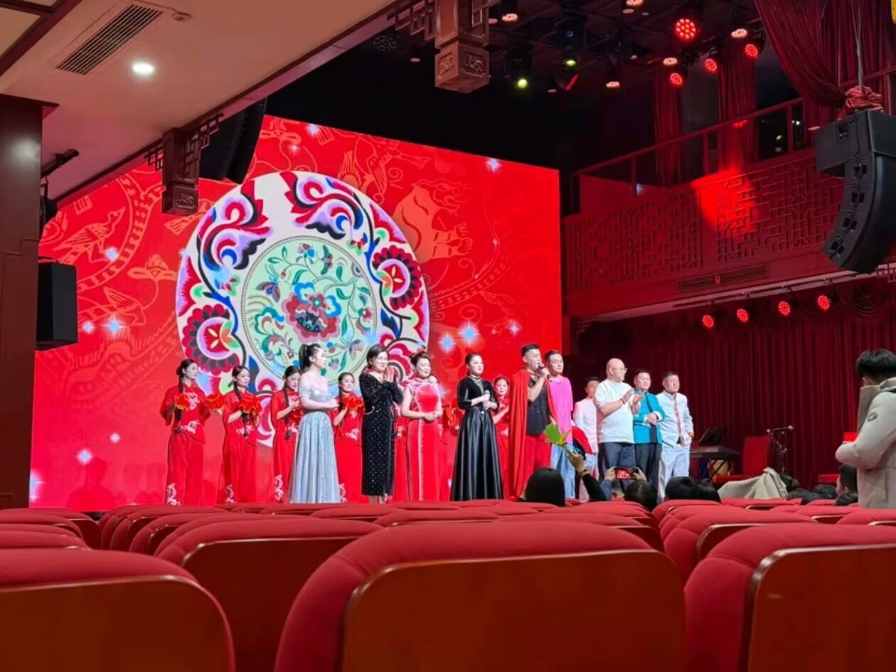

老实说当我听到父亲也给我买了一张票时，那一刻心中五味杂陈。

我想到小时候村里那些为老人送行的席，在那些席上为大家表演节目的人们，一辆被尘土漂染的白色货车，货箱被改装成了一个不大不小的舞台，衣着鲜艳闪亮的男人女人在上面卖力地喊唱着，两边黑色庞大的音箱孜孜不倦地震动房间的玻璃窗。我那时好奇，离去值得这么热闹吗。

有些卖弄的表达；十分冒犯的荤段子；嘈杂的歌曲（DJ版），感觉与春晚的二人转完全不同。折磨伴着偶尔的欢笑度过了2小时的吵吵闹闹，我只觉得像是货车开到了城市里。与父亲告别，一进地铁就把耳机里的流行乐开到最大声。

但说到底，我并不认为这种形式不好，只是我对这种艺术不感冒而已。与我隔着过道的座位上，有位穿着棕色风衣，衣服长到只露出一双灰鞋的中年男人，从演出开始音乐响起到结尾谢幕，他双腿随节奏的抖动一直没停。在他的前面，一对夫妻手中的拍子自始至终反复锤打着前排椅背。而坐在我身边的父亲，即便在现场热情洋溢时也不随着叫喊，也不跟着音乐抖腿打拍子。有时大家鼓掌，他拿起拍子轻轻拍一下又放回；有时他随着歌曲轻轻哼唱；演员出糗时，他也跟着大家笑。我只见过父亲嘲弄自己与迎合别人的笑。

这是属于我父亲那一代人的艺术，我只是那个坐在房间里只觉外面吵闹的孩童，路过橱窗向内张望的过客。
