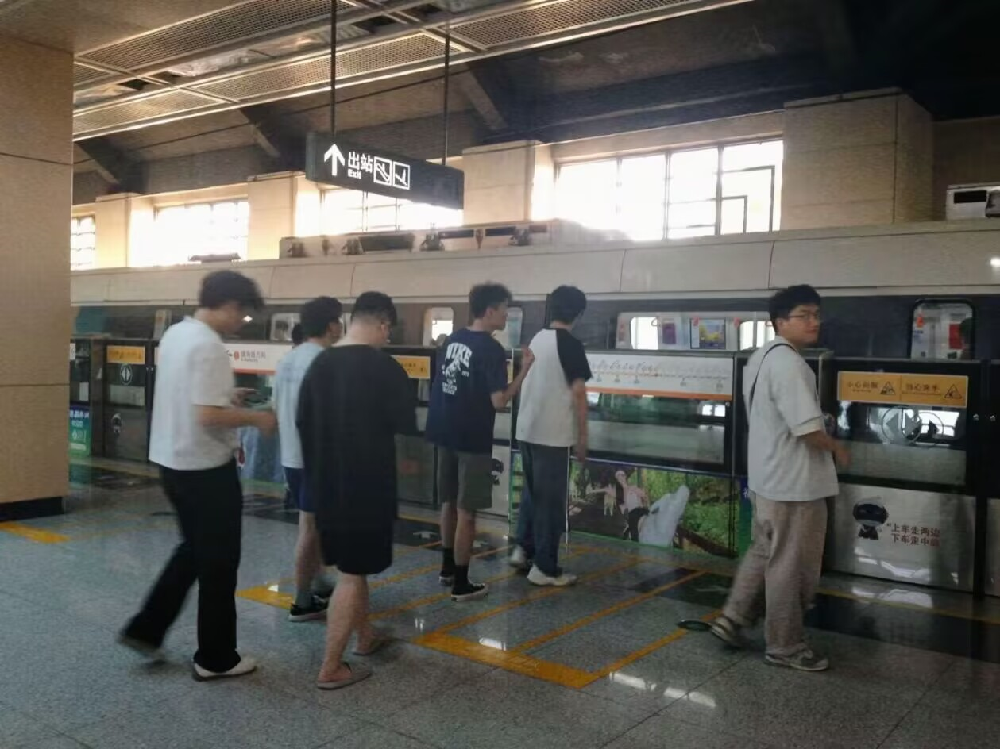

*Remember me, Though I have to say goodbye.*

---

旅行时，初中玩得好但现在联系极浅的朋友问我：现在心中最要好的朋友是谁？我脱口而出是与我同大学的高中朋友，他愣了一会像是在组织语言，然后问我：“第二好呢？” “…大学舍友吧”，我如实回答。

那个与我同校的朋友此刻站在我们旁边，突然说到我也许是按照与他们现在来往的密度来划分交情的深浅。我恍然意识到初中朋友为何追问，也意识到高中朋友在为我找补。也许他在寻找自己的位置。

我们在一座酒馆驻足闲聊，原来他和我一样惋惜初中与朋友的要好与熟络，也都想做出一些努力希望重新建立起联系。不同的是，现在我已全然放弃。

之前与一位朋友聊天，我说那些事情其实是“一厢情愿”，反倒发觉自己维系关系的能力极其有限。不再有相同的教室，不再经历同一场考试，不再处于同一座城市，我与她们的话题并不随着各自的活动范围扩大延伸，而是停滞在了陈年往事。

慢慢地我觉得“朋友”是一种萍聚萍散的关系，现在想来被高中朋友一语中的，我的确是按照当下的交往密度来确定友谊深浅。那种“一辈子的好兄弟”只能说可遇不可求。

既然因缘分相聚相遇相识，那就珍惜着享受。直到相别的那天，再坦然接受。

