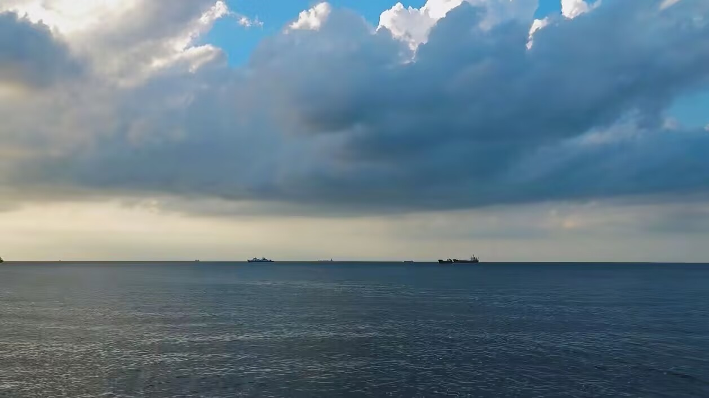

中午吃完饭，走在去图书馆的路上。学校的行道树即便吹着寒风也绿葱葱的，茂密的树叶相互舞动触碰着，穿透我的耳机喧嚣着，于是把耳机摘下了。

阳光穿过前些天的阴霾，在上空肆意宣泄着它的热，热打下来，路旁的湖中水翻滚着；湖畔的鹅群交响着；湖上的海鸥也在叫唤，可这里没有海鸥，我想大概是听错了。忽然看到路中间的草地上有只酣睡的灰猫，于是我学他也闭上眼睛。

风律动地吹着，树叶喧嚣的更大声，像海浪的声音，海鸥也在欢呼。双脚传来海水的冰凉，潮湿弥漫在空气中，我望向遥不可及的天际，我好久没看过海了…风吹着，树叶摇动着，鸽子叫着，猫呼唤着，我不想睁眼。
