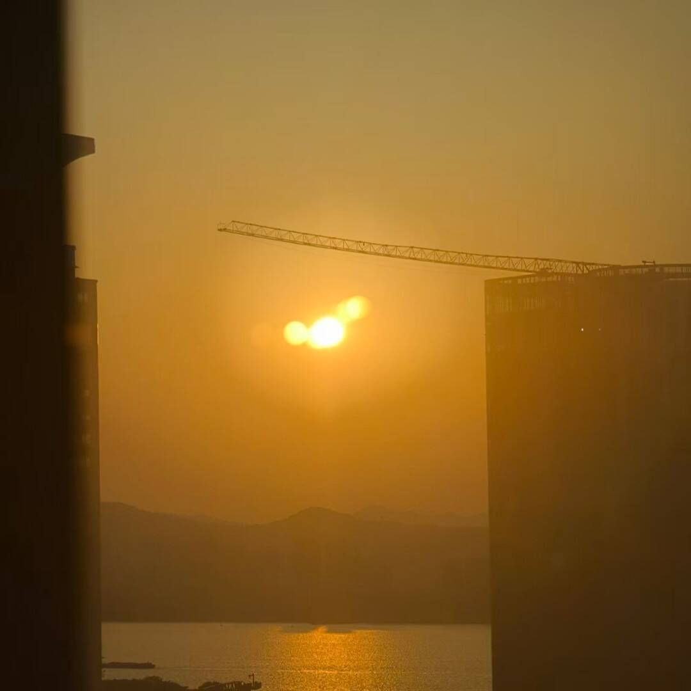

“你更喜欢日出还是日落？”

“日落。”

“为什么？别跟我说是因为早上起不来见不到日出。”

“因为日落跟一部分的我很像。”

“哪部分？”

“痛苦。”

“你也会有痛苦？”

“人都有痛苦。”

“但痛苦怎么会像日落！”

“颜色。”

“痛苦也有颜色吗？”

“有的。比如我的就是橙色。”

“橙色的痛苦吗？听起来…… 还挺美的？”

“嗯，是挺美的。”

“我以为痛苦就算有颜色，也会是那种黑色灰色什么的。”

“黑色太绝望，灰色太压抑。”

“橙色是红色和黄色的结合，是燃烧的颜色。”

“是像燃烧一样的痛苦吗？”

“燃烧不痛苦，但燃烧殆尽很痛苦。”

“还在发光、发热，但每一刻都更加黯淡。”

“不确定还能撑多久，但你知道一定会熄火。”

“大概能理解。可我还是感觉橙色不够痛苦。”

“橙色不会太过绝望或是压抑，它只是一种力气快要用完的颜色。”

“痛苦也不是都有悲惨的经历，或是都要尖叫、大哭、要死要活的。”

“那橙色的痛苦是什么样的？”

“缓慢沉没。一点点熄灭，一点点下沉。”

“没什么特别的，就只是…… 慢慢地沉下去。”

“像日落。”

“对。是像日落。”

“……”

“…………”

“那之后呢？”

“……”

“什么？”

“沉下去之后呢？”

“之后天就黑了。”

“不痛苦吗？日出之前一直在黑暗里。”

“其实接受结果是很简单的事，痛苦的永远是过程。”

“而且，你忘记了一件事。”

“什么？”

“日落之后，会有星星。”

“那会很美。”

“所以…… 你享受痛苦？”

“不。没有谁会享受痛苦。”

“我只是承认它。我会看着它发生，然后等着，等星星出来。”

“就像你不会疯子一样阻止日落。”

“对。要允许痛苦。就像允许快乐。”

“反正太阳明天照常升起。”
