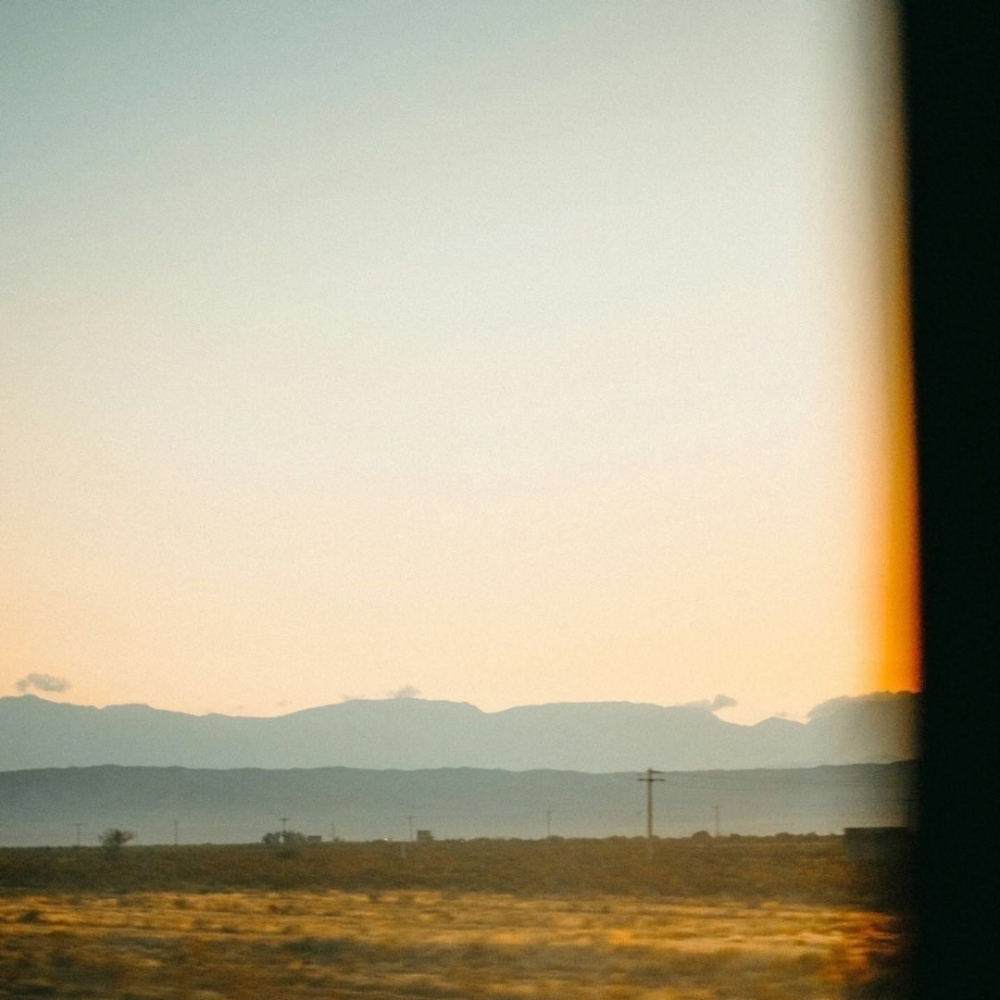

“你会害怕明天吗？”

“会。”

“因为什么？未知？还是别的什么？”

“和你一样，我对明天的恐惧来自对今天的厌倦。”

“你怎么肯定我跟你一样？”

“这是首歌。不重要。”

“你的意思是，你对今天感到厌倦，所以害怕明天也一样。”

“可以这么说。”

“可是如果你厌倦了今天，不应该盼着明天早点来吗，怎么会害怕呢？”

“期盼和恐惧，那是同一回事。”

“怎么可能！这两种感觉怎么想都差远了吧！”

“……”

“你失眠过吗？”

“当然！”

“第二天有重要的事的时候呢？”

“也有过！”

“那么你睡不着的时候，会想明天的事吗？”

“…… 会。会想再不睡着的话明天可能要迟到、迟到了会怎么样、会不会搞砸……”

“你在期盼天亮，也在恐惧天亮。”

“诶？好像确实是…”

“你害怕什么的同时，就在期盼它不要来。”

“而你越期盼什么，就越害怕它落空。”

“……”

“所以你就一边害怕，一边盼着明天到来？”

“基本上是的。”

“那怎么办？试着不那么期盼？”

“恐惧比麻木强。”

“就没有什么办法吗？这两种感觉都太累了。”

“我也不知道。我只是试着不再假装这两者能分开。”

“有用吗？”

“有一点。”

“那你明天还会害怕吗？”

“会。但我清楚地知道我的恐惧和期盼。”

“知道又能怎么样？有区别吗？”

“有。”

“我可以在害怕的同时把牙刷了。然后试着让今天变得不一样。”

“然后每天都会不一样。”
