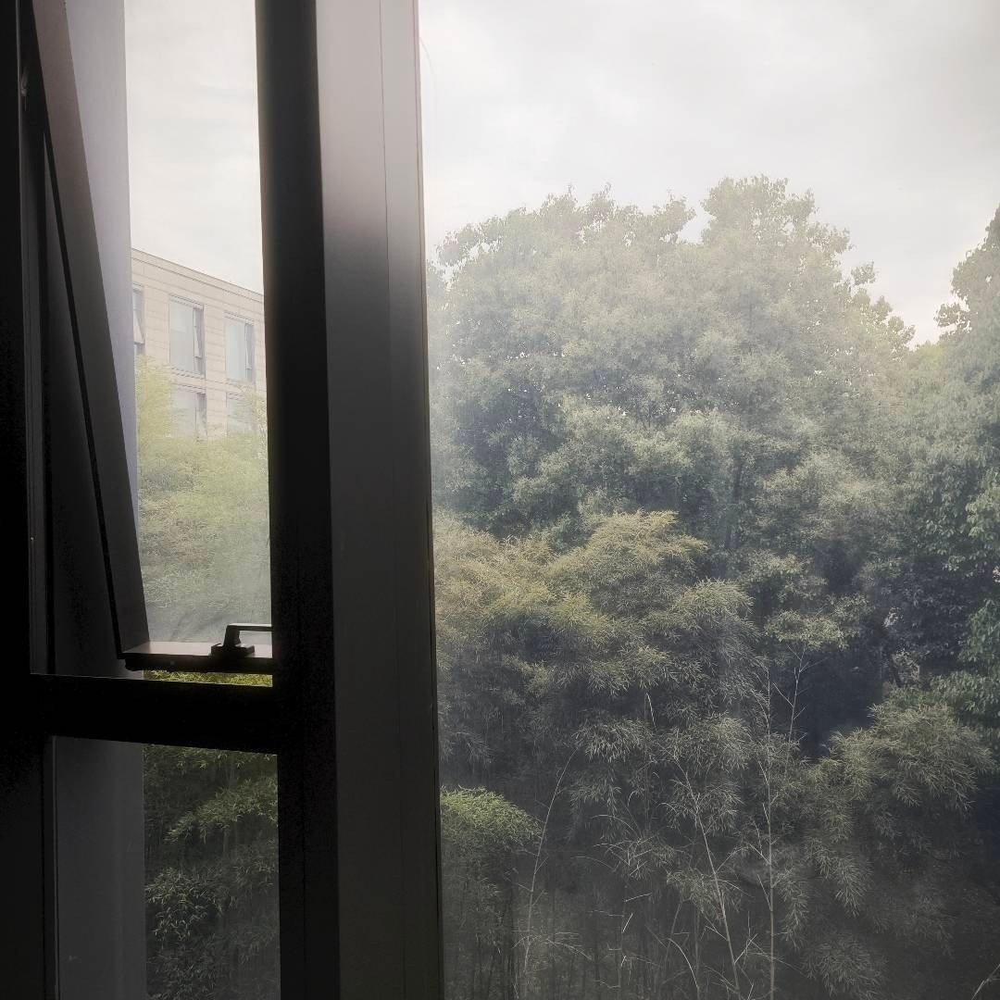

“你觉得成长是什么？”

“窗。”

“窗？”

“对。确切地说是不断把自己封在窗里。”

“你是说把自己关在窗里就叫成长？”

“是的。”

“所以… 为什么？就不能是门或者墙什么的吗？”

“你还可以看得见过去的你。但你出不去了。”

“可我已经想不起来我很小的时候是什么样了。”

“这很正常。你一直在成长，窗会越来越厚。”

“…… 不对，还是不一样，是窗的话我出得去。我可以砸碎窗子。”

“对，你可以。但砸窗本身也是成长。所以没有意义。”

“所以你才总对着窗户发呆吗？你在看什么？”

“我。尚且年幼的、没有烦恼的我。”

“已经奄奄一息了。”

“那窗户里呢？现在的你吗？”

“……”

“现在是几月份了？”

“五月。”

“那么窗里是夏天。”

“尚且年幼的、即将迸发的夏天。”
