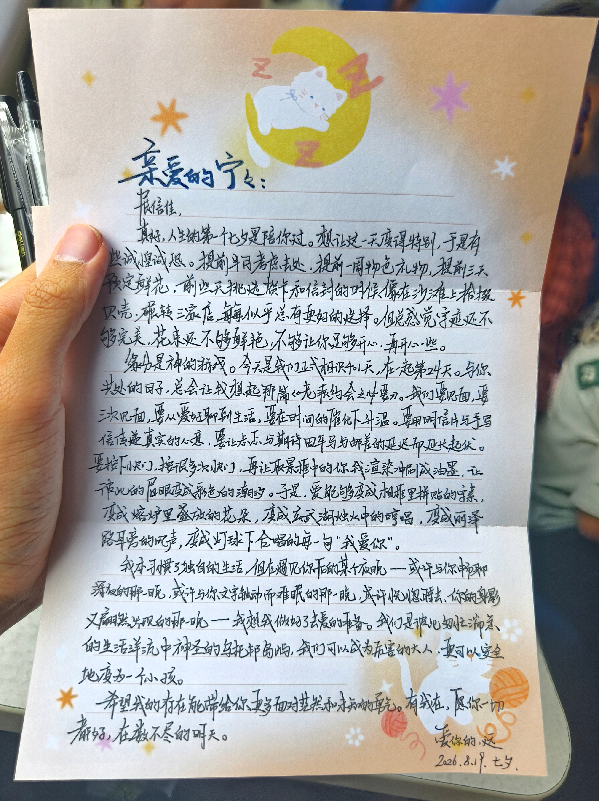

亲爱的宁宁：

展信佳。

真好，人生的第一个七夕是陪你过。想让这一天变得特别，于是有些诚惶诚恐。提前半月考虑去处；提前一周物色礼物；提前三天预订鲜花。前些天挑选贺卡和信封的时候，像在沙滩上捡掇贝壳，辗转三家店，每每似乎总有更好的选择。但总感觉字迹还不够完美，花束还不够鲜艳，不够让你足够开心，再开心一些。

缘分是神的游戏。今天是我们正式相识 401 天，在一起第 24 天。与你共处的日子，总会让我想起那篇《[老派约会之必要](https://zhuanlan.zhihu.com/p/1914693606540830246)》。我们要见面，要三次见面，要从爱好聊到生活，要在时间的催化下升温。要用明信片与手写信传递真实的心意[^1]，要让忐忑与期待因车马邮差的延迟而延宕起伏。要按下快门，按很多次快门，再让取景框中的你我渲染冲刷成油墨，让彼此的眉眼变成彩色的潮汐[^2]。于是，爱能够变成相框里拼贴的字素[^3]，变成熔炉里盛放的花朵[^4]，变成玄武湖烛火中的哼唱[^5]，变成丽泽路耳旁的风声[^6]，变成灯球下合唱的每一句「我爱你」[^7]。

我本习惯了独自的生活，但在遇见你后的某个夜晚 —— 或许与你畅聊深夜的那一晚，或许因你文字触动难眠的那一晚，或许恍惚睡去，你的身影又翩然出现的 [那一晚](https://leehenry.top/posts/words_in_wildness/ww-vol08/#%E5%88%87%E7%89%87-%E5%85%AD%E4%B9%8B%E5%85%AD) —— 我想我做好了去爱的准备。我们是彼此匆忙湍急的生活洋流中神圣的乌托邦岛屿，我们可以成为厉害的大人，更可以安全地变为一个小孩。

希望我的存在能带给你更多面对茫然和未知的勇气。有我在，愿你一切都好，在数不尽的明天。

爱你的，远 
2026.8.19 七夕

[^1]: 我曾在年关以将亲自设计的明信片寄予他，用隐喻书写祝福。再后来我收到他寄的一纸手写信，藏在糯米纸后的追求被看穿
[^2]: 他同样热爱摄影。他与我完成期待许久的毕业照策划，我与他也在街道、展览抑或是餐厅中留下无数拍立得的记忆
[^3]: 我第二次见面的见面礼，是一首嵌在相框中的 [拼贴诗](https://leehenry.top/posts/moment_memos/mms-vol09/)。我的毕业照也是这一次见面完成的
[^4]: 而他送我的生日礼物是一束用玻璃烧制的永生花
[^5]: 生日前那晚，漫步玄武湖，我在灯火倒影中吹灭 22 岁的蜡烛。他注视着我，张悬的《宝贝》响起
[^6]: 他喜欢我从背后环抱住他。丽泽路上飞驰时，我想起《空帆船》「当我听到风从我耳旁呼啸着掠过」
[^7]: 在 KTV 的灯光包围中，在安溥和陈绮贞的见证下，我们相信每一句歌词的「我爱你」

<mbr>
