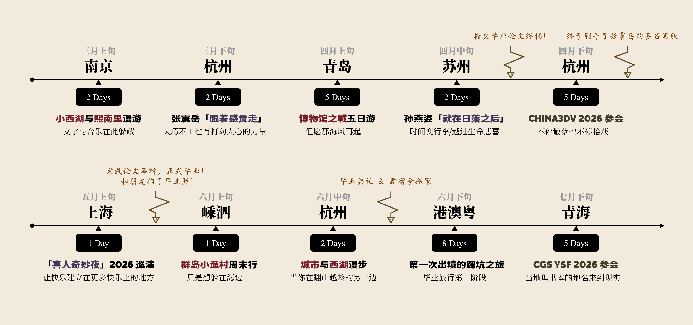

暂缓更新的两个月，我完成了宿舍搬迁，正式结束了一切毕业事宜，过了一段繁忙而充实的现实生活。

谢谢你，还在关注这里的读者朋友。

这段时间虽然繁忙，但还是见缝插针去了很多生活主线之外的地方。前几天去青海出差，回来的飞机上用会场上分发的纸笔涂涂画画，陆陆续续写满了一页 A4 纸。

---

时间是残忍的。每一个彼时的当下，我所经历的是流动、连续、高语境的体验，而体验本身的记忆会随着时间的流动分解重组、聚合沉降。多数记忆会变质失活，少量记忆会凝固下来，只有当回忆被重新召回时，才重新变成一些亦远亦近、难以言表、隐约抽象的感受。

生活发生时，我有时调整对焦距离与光影角度按下快门，有时给远方的朋友编辑即时通讯信息，有时刻意或随机的录制下现场的Live图或视频切片……本质上留下的终归只是记忆的取样点，以图像、文字、声音的不同模态存在。它们是离散而易逝的，

你将在这里看到一些

<mbr>
