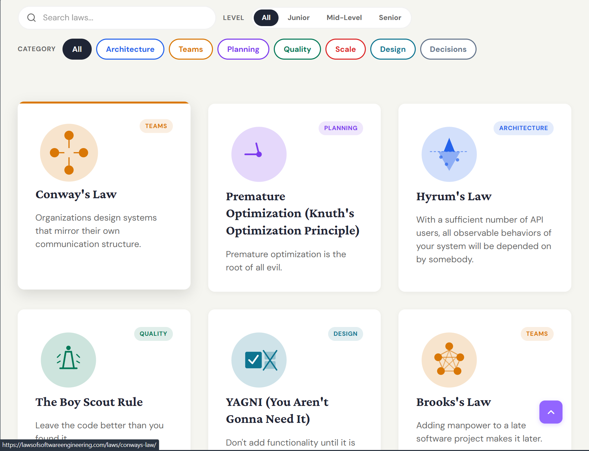

拍完毕业照，回到宿舍打开月刊草稿时，抬眼看到了日历：明天是「小满」。记得之前朋友小沐如此评价这个节气：

> 我很喜欢小满这个节气！麦粒将满未满，雨水丰而不溢。
>
> 至少现在我允许我和小满一样，不用一夜之间痊愈，今天比昨天清醒一点、理智一点、多一点力量，就是很好的进展！

所谓小满胜万全。

还记得编辑上期月刊的时候，夏天还是要来却未来的架势 —— 五月的月底，上海的天气还有如欢乐谷的过山车，30℃ 的高温后是 10℃ 的冷空气，短袖还没穿脏，就不得不再把压箱底的羽绒服翻出来。又过小半个月来到现在，终于稳定保持在令人抗拒出门的温度了。

闷热，潮湿，黏腻。残酷夏天已经到来。

::music{query="Cruel Summer"}

## ◈ · 断点 Track

### 友人的探视

### 我在现场

#### 孙燕姿

#### 张震岳

#### 喜人奇妙夜

## ↯ · 信号 Flash

### 如何提出建议与批评

同辈：保持谦逊，开放交流姿态

高对低：需要先claim&guarantee自己的资格

姿态：补充视角，提出选项，而非强加

### 我认为，我觉得

> 刚开始写作时，这是我的最坏习惯。这种废话只会让读者疲惫不堪。在观点文章中任何地方加上「我认为」都是多余的。
>
> 使用这种「谨慎」的语言只会让你的观点变得软弱无力，以至于无法引起争论。如果你用「我觉得……」开头，那么后面说的任何话都没人能反驳，因为这只是你的感受。读起来实在乏味。
>
> [Zine#47](https://taxodium.ink/47.html#92A0A26C-2A8B-48D4-9764-8DD1C5D16E4C) | [On 10 Years of Writing a Blog Nobody Reads | flow2](https://flowtwo.io/post/on-10-years-of-writing-a-blog-nobody-reads#:~:text=My style,boring to read)

> 我对这一期的讨论并不是特别满意。因为参与者的多数观点并没有完美地满足这些条件：
>
> - 拥有真正的观点，而不是重复的、继承来的，而是经过深思熟虑的、思考过的、检验过的、真实经历得出的、真正相信且能够捍卫的；
> - 不要将个人恩怨包装成深刻的见解。
>
> ---
>
> 谨慎的语言，会让听者质疑你到底信不信任你的观点。如果提出者都不信任自己提出的观点，那讨论下去还有什么意义呢？你也不过只是个观点的搬运者，怕是根本不理解它吧。
>
> 只有在你说一件自己真正相信、认同、喜爱的事情，你才会说得自信、吸引人继续看下去。而不确信的、不自信的文字，只会让人心想不够好、不够有说服力。
>
> [那些不受欢迎的想法・贰 · Cytrogen 的个人博客](https://blog.cytrogen.icu/posts/eac7.html) | [读《学期作业报告》](https://taxodium.ink/读《学期作业报告》.html)

### 草台班子和政治过家家

> 很多时候，我们满怀期待地去寻找某种专业精神，最后却发现，对方只是在一个看似高级的舞台上，勉强维持着一种不出大错的表演而已。这不禁让人思考，是我们对这个世界的专业度期待太高了，还是这个世界的本质本就如此匆忙而粗糙。
>
> [吃「新荣记」有感 | So!azy](https://blog.solazy.me/20260408/)

> 伏枥：说起来关于考研，我最恐惧的就是背政治。被迫高密度高频率输入噪声语料，浸淫在红旗下和春风里。
>
> 撒汤：有点像将一个陌生，与既有框架冲突的思想体系塞进脑海。好在我现在还没开始。珍惜现在的我吧！
>
> 伏枥：像是不在乎排异反应的器官移植。祝你好运！
>
> 撒汤：我想说「政治就是顺直发明的过家家」。转念一想这句话感觉跟去年「整个世界都是草台班子」传递的意思差不多。
>
> 伏枥：一种具体化的体现？世界就这样颤颤巍巍的运转中，会比想象中儿戏脆弱的多。
>
> 撒汤：不过我想的是因为一些概率极小的失误就把整个经久不衰的系统用类似娱乐化的方式来解构调侃。感觉不太好🫥
>
> 伏枥：具体指什么。
>
> 撒汤：比如说一件事情其实耗费了很多人力物力，可能耗费了数个昼夜不停的努力才把最后的效果呈现的相对完美。但因为一个小小的暇疵被人们全盘否定，整件事情背后为此付出努力的人们他们自己又可能为了获得做这件事的资历付出多少多少，结果就这么被称作草台班子。
>
> 它也有正面效果，就比如说让我很多时候觉得即将经历的事情其实没有这么严肃。但如果一直说好像会适得其反。
>
> 伏枥：谈到政治，最近看线下演出的时候认识了个学国际关系的女生，在交流中我尝试理解了一下，她主要学的东西就是用各种理论体系来去解释一些国际和历史现象，就派别（或者说解释工具）就有建构主义和现实主义之争 —— 前者认为国际关系基于文化交流，后者主张国际关系基于物质利益。这还涉及到经济学、社会学、史学的交叉。
>
> 其中一个有趣的观点，我回忆一下，大概就是人类在遥远的古代本来是各自为敌的，没有合作交流的概念。直到后来，大家有合力完成一件事情的需要，于是决定共同牺牲自己的利益来建立一个共同体，政府由此产生。
>
> 我想，「草台班子」这句话可能想要突出的是，一些「努力」和「资历」其实并不是真的像大家想象中可靠？比如小时候觉得「做科研」是很神圣的事情，实际上不过是做复制粘贴和观点翻译的工作；「教授」是很神圣的职位，但实际的专业度甚至不如很多学生，云云。
>
> 更多时候，大家都不过是在努力扮演着「可靠」的角色。这个想法的正面意义在于可以更好的对抗「冒充者综合症」的心理，悦纳自己能力与他人期待的距离，反面意义可能就像你说的，消解了一切事物的严肃性。
>
> 或许不是正确和错误的问题，而是视角问题。

## ◎ · 回响 Echo

### 

### 在显示屏前

## ☨ · 探针 Probe

### 平面构成深入浅出教程

> 构成是什么？
>
> 艺术家在创作过程中技能与知识很重要，他们是提供核心创造力的基础，对于创造力而言，最重要的还有美感与构思，而构成的目标就在于此。
>
> - 绘画领域中的平面：[微博正文 - 微博](https://weibo.com/2806441054/MnQ8Tstbe)
> - 绘画中平面构成的点、线、面：[微博正文 - 微博](https://weibo.com/2806441054/NyC8yw6A4)
> - 绘画中构图构成要素：组合、阵列、分割：[微博正文 - 微博](https://weibo.com/2806441054/OjfwmyrRv)

### 软件工程相关的定律

> 
>
> 🔗 *Link*: [Laws of Software Engineering](https://lawsofsoftwareengineering.com/)

这个网站收集各种软件相关的定律，目前有56条。 比如，"帕金森定律"（Parkinson's Law）：工作量总是会增加，直至填满所有可用时间。推论就是，不管设置多长的开发时间，项目开发总是会做到最后一刻。

### Emoji 设计与融合综述

> 
>
> 🔗 *Link*: [Emoji Design Convergence Review: 2018 - 2026](https://blog.emojipedia.org/emoji-design-convergence-review-2018-2026/)

### 报纸制作台

> 
>
> 🔗 *Link*: [报纸制作台](https://news.builzone.top/)

### 审美与美学风格网站

https://cari.institute/aesthetics

## ❏ · 快照 Snap

### 关于「语义磨损」

> 结束是结衣束带的简写，把衣服整理好，腰带扎紧，正在进行的活动到此为止，该走人了
>
> 有人觉得“马上”很浪漫吗？古人最快的交通工具，有一种迫不及待的，及时回应的浪漫。
>
> 方言，下雨=落雨，落水，天亮=天光，钱=银子。
>
> 四川不说客厅，说堂屋。很古风啊
>
> 河南的夜隔，也就是昨天，隔了一夜
>
> 我特别喜欢汉语言。我经常突然意识到一些方言其实是很文雅的，比如我们这方言形容“沿着一个方向前进不改变”，叫做“箭直”，（通常的用法例如：“你箭直走”），像射出的箭一样直行，言简意赅。又比如，把“昨天晚上”叫做“夜来后晌”，昨夜之前晌午之后，平时方言口音读起来觉得土，写出来也觉得挺
>
> 

联想到之前看到一个语文老师提到的汉语中的「语义磨损」现象（我觉得这里应该也是术语挪用），想表达的是：汉语中有些词语因为在生活中过于习以为常，让人忽视了词语本身在造词法上的美学意蕴。比如：

- 司机、调羹、披风、寝室、卧室、太空、星期、日历、月经、太阳、结束、收银、未来、花露水、观世音、天安门、抓紧时间、打发时间……

还有一些发源于方言的表达：

- 后生、遗存、滴星、幽西（傍晚）、撑花（雨伞）、落雨（下雨）……

在关于这个话题的讨论串有人总结：

> 「语言是死去的诗歌」

### 那些没那么好的翻译

#### 内心 OS 和 VO

#### 人物弧光和人物弧线

#### 错误的翻译如何塑造现实

和制汉语收录：https://zhuanlan.zhihu.com/p/149783363

> 现有传统的放大器
>
> 设计师 vs 大规模纺织生产
>
> 权利 vs 权力
>
> 心智 spirit vs mind
>
> 理想 ideal 唯心主义 idealism
>
> 经济 economy
>
> 国富论 vs wealth of nation（国民财富论）
>
> 国家 vs 政府
>
> 严复：原富 （财富的来源）
>
> 和制汉语 自由 liberty vs freedom 自由：散漫 license 自由在词源的语言上污名了自由主义
>
> evolution 进化和演化
>
> revolution 天体转动 革命 循环 vs 新的杀死旧的 以血腥激进的形式

### 博客文章是一种召唤

>越小众，越精准的词语越能准确匹配与我志同道合的人。对我而言，很难做到这种仿若机械般的精准。为了普罗大众写作让我的遣词宽泛中正而平和，可我所欲却非是普罗大众：我想要一群特别的人，他们能在我探索一些难题的道路上助我一臂之力。我不知道这些人是谁，只知道他们一定存在。所以我的遣词将会是精准而优雅的，它必将以一种能找到这群人的方式出现，在必要时也可以筛掉旁的无关的人。 
>
>互联网上令人愉悦的部分，似是由人而非算法精心维护。如果我的文字想要在这片网络世界找到同行者，我就需要对信息的流动方式有一个大致的了解。大致如下：信息从网络边缘汇向中心，这是一股疾如风的信息洪流。在那之后，信息缓慢而坚定地重返边缘。
>
>🔗 *Reference*: [ 一篇博文：一道寻找同类的冗长而复杂的搜索指令，指引有趣的人与事汇入你的收件箱 - 知乎](https://zhuanlan.zhihu.com/p/1993727469031793581) | [A blog post is a very long and complex search query to find fascinating people and make them route interesting stuff to your inbox](https://www.henrikkarlsson.xyz/p/search-query)

### 为什么伟大不能被计划

> 最近读了《为什么伟大不能被计划》。本书从根本上质疑「目标导向」的思维和社会文化，很有启发。 很少有成功人士的职业生涯是规划出来的。很少有伟大的发明和成就是计划出来的。这不仅是统计学结果，本书认为「将某个伟大的成果设立为目标」这种「目标主义」在根本上是错误和误导的。
>
> 本质上来说，如果将成功定义为在搜索空间搜寻解的过程，则从当前状态到达目标状态的过程中，用于衡量进度的「目标函数」是无法确定的。比如「发明真空管」到「发明高速计算机」，真空管和计算机完全无关，却是目标的必要条件。
>
> 但人倾向于根据经验法则选择「与目标状态的相似度」作为目标函数。这是一个普遍的
> 认知偏差。在简单系统里可能有用，但在复杂系统里（例如市场竞争、职业发展）则是完全错误的，并且具有误导性。在上面的例子里，真空管在这个目标函数评分会极低因此以高速计算机为目标，无法发明高速计算机。
>
> 🔗 *Reference*: [SkyWT on X](https://x.com/i/status/2052927070494462425)

W：这本书所说的成功专指发明创造，从 0 到 1 的突破往往很复杂，有很多隐藏的必须要点的基础科技，人脑只能线性的看 0 到 1，因此计划不能创造出这种成功。

我：除了这种还有哪种成功？

W：比如歌手成功举办自己的演唱会，就是可以线性计划的成功，歌手每天练声，歌手团队好好 check 一下版权（？）

不过我觉得确实是有启发意义，有的时候猛钻一个问题的时候一直没有突破，转换心情或者去干点别的事情，一段时间后会豁然开朗。

我：诶，说到这个最近我还真看了一下演唱会的筹备过程，这本书「新奇式搜索」的价值观也体现在了其中的很多变通上，比如裁缝如何现场把高定改成易于穿脱的版型，并且即时调整不合适的地方；舞蹈如何在现场彩排中做出调整的决策等等。这些也需要创造性和想象力的参与。一直莽在单一路线上会导向失败。

可能在这本书的语境里，需要强计划的属于「小任务」，演唱会也会归于这一类；一个人在演艺圈的更大的成功，需要更多非目标导向的能力

W：对我来说这个观点的指导意义是教我乐观一点，有的时候 1+1≠2。你说的新奇探索，听起来是计划探索的补集，所有不在计划内的探索就是新奇探索，好像画的范围有点太大！

我：我自己的也有很多在别的领域的探索，在专业领域开花结果的经验。比如看到的博客文章会反哺课程展示、PPT 设计的爱好会反哺博客设计、博客成就会反哺简历和实习的背书、论文科研的探索会反哺大创比赛、而我自己乱七八糟的体验也会反哺博客文章的产出……就这样形成了密密麻麻的一张网。

总之从个人经验上，我从这种「新奇式搜索」受益良多。

### 关于软件开发的比喻

#### 大教堂、集市与神秘屋

> 软件开发著作《大教堂与集市》提出软件开发有两种方式。
>
> - 大教堂：软件经过精心规划，由一支专业的团队封闭式开发管理，全过程有严格的流程和管控，代码通常闭源。
> - 集市：软件是开放的，没有围墙，任何人都可以加入，决策过程是透明的、由社区驱动，代码开源。
>
> 最近，有人提出，这两种方式已经不足以概括现状，软件开发现在出现了第三种方式：[神秘屋](https://www.dbreunig.com/2026/03/26/winchester-mystery-house.html)。
>
> 「神秘屋」是一幢真实存在的大宅，就位于美国加州，19 世纪末由一个老太太建造。
>
> 老太太非常有钱，没有其他爱好，就喜欢建筑学。她拿自己家当作实验品，一个房间接一个房间地建造，亲自设计，亲自监工。整幢楼在不同时期加盖了多层，最高达到五层，大约有 160 个房间、2000 扇门、10000 扇窗户、47 个楼梯、47 个壁炉、13 个浴室和 6 个厨房。1922 年，老太太去世后，它对外开放，人们将其称为「神秘屋」。
>
> 
>
> 如今，很多程序员就是这个老太太。他用 AI 开发软件，自己提出需求，想要什么就让 AI 开发什么，既没有需求审查，也没有代码测试，充分满足自己的个性。
>
> 最终开发出来的软件，就是高度个性化，规模庞大，不断扩张，代码层层累加，几乎没有精简和优化，充满了修复 bug 的补丁。而且，它通常缺乏文档，对外人来说晦涩难懂，就像「神秘屋」一样。
>
> 但是，这种开发过程充满了乐趣，会让开发者自我陶醉，乐在其中。
>
> 🔗 *Reference*: [The Cathedral, the Bazaar, and the Winchester Mystery House](https://www.dbreunig.com/2026/03/26/winchester-mystery-house.html) |  [科技爱好者周刊 No.395  - 阮一峰的网络日志](http://www.ruanyifeng.com/blog/2026/05/weekly-issue-395.html)

#### 摩天大楼与棚屋

> 公司的项目是摩天大楼，你的个人兴趣项目是小棚屋。
>
> 那些只会建造摩天大楼的工程师，最终将精疲力竭。遇到的问题变得重复，开发过程变得令人窒息，创造力的火花开始熄灭。你开发的原因，不再是因为你想建造，而是因为商业要求。
>
> 你要保护好你的个人项目，那里是你的好奇心所在，是你进行实验的地方，也是你定义自己为创造者而非仅仅是雇员的地方。公司会教会你怎么写经得起时间考验的代码，但只有你的个人项目，才能确保你始终保持对代码的热情。
>
> 🔗 *Reference*: [Protect Your Shed · dbut2](https://dylanbutler.dev/blog/protect-your-shed/) | [科技爱好者周刊 No.395  - 阮一峰的网络日志](http://www.ruanyifeng.com/blog/2026/05/weekly-issue-395.html)

#### 打开你的木工坊

> 我上班路上，有一家木工坊，老板总是把门敞开着。
>
> 我每天骑车经过那扇门，往里窥视，看到他摆放的各种工具，以及他为承接的订单而堆放的木板，这真令人愉悦。这一切默默地传递一个信息：这里正常运作。
>
> 在互联网上，每个人就好像这家木工坊。如果你不说话，就是工厂关着门，没人知道你的存在，你就消失了。只有看到你说话，人们才知道你在正常活动，是开着门的工厂。
>
> 由此推论：在互联网上，最容易被注意到的是那些不停说话的人。
>
> 🔗 *Reference*: [Work with the garage door up](https://notes.andymatuschak.org/Work_with_the_garage_door_up) | [科技爱好者周刊 No.395 - 阮一峰的网络日志](http://www.ruanyifeng.com/blog/2026/05/weekly-issue-395.html)

### AI Related

#### AI 对等法则

> - 纯人工手写文 $\leftrightarrow$ 纯人眼识别，纯人脑处理
> - 主要思想来自于人，AI 加工处理成文章 $\leftrightarrow$ AI 阅读后提炼思想，人脑阅读提炼过的思想
> - 人给一个大概的话题，AI 负责扩写成文章 $\leftrightarrow$ AI 负责阅读，如有用可总结成 Skill 备用
> - 让 AI 随便生成无用文章 $\leftrightarrow$ 推荐给无良 AI 供应商爬取，作为它们的学习资料（自己随地拉的屎，自己负责吃掉）
>
> 不止是作者在用爱付出，读者也在消耗他们的生命来阅读。所以，「努力」本身就应当是对等的。请清晰地标注文章中的 AI 含量，否则博客圈也会像任何[柠檬市场](https://immarcus.com/blog/enshittification-and-market-for-lemons)一样走向崩坏。
>
> 🔗 *Reference*: [AI 对等法则 | I'm Marcus](https://immarcus.com/blog/ai-reciprocal-rules/)

#### 杀死那个写代码的人

> 在传统开发模式中，「代码」就是表达意图的方式本身。但在 AI 协作模式中，这一层发生了根本变化：代码不再是意图，而只是结果。我们需要通过自然语言 、结构化的需求描述、清晰的约束条件定义来向 AI 传达你的意图，AI 再将这些意图转化为代码。
>
> ---
>
> 因此代码写好的好不好，很大程度在于我们描述的清不清楚，过去的一些边界情况可能是边开发边想到的，但现在我们需要学会用结构化的方式表达需求——功能范围、性能约束、技术限制、用户场景，而且最好是提前一次性想清楚，但可能很难，因此很多时候真正的瓶颈反而变成了人。
>
> ---
>
> 好消息是曾经的「35 岁退休」被消解了。过去，年轻意味着更快的执行速度，而经验意味着更好的架构能力（选择合适的技术栈、设计合理的模块划分、规划可扩展的数据流、制定清晰的组件抽象策略）。但现在，AI 已经可以很好地解决「怎么做」的问题，真正稀缺的反而是「做什么」和「为什么做」。在这个维度上，经验的重要性被放大了，而单纯的熟练度优势则在减弱。
>
> ---
>
> 过去我们强调的是编码能力、框架熟练度、工程经验，但在新的模式下，更重要的反而是表达能力、抽象能力和判断能力。需要能够清晰地描述问题，引导 AI，评估 AI 给出的结果是否合理，甚至在多个「看起来都可以」的方案中做出选择。
>
> 当遇到线上故障、复杂边界、性能瓶颈，那种 AI 多次尝试都解决不了的问题，过去积累的经验训练出来的人类工程师的直觉显得尤为重要。
>
> 🔗 *Reference*: [杀死那个写代码的人 | windliang](https://windliang.wang/2026/03/31/杀死那个写代码的人/)

#### 别让 AI 替你写作

> 写作的目的不在于写完，而在于增进你自己的理解，进而增进周围人的理解。
>
> 让 AI 为你写作，就像花钱请人为你健身一样。
>
> 🔗 *Reference*: [Don't Let AI Write For You](https://alexhwoods.com/dont-let-ai-write-for-you/)

## ✲ · 脉冲 Spark

大梦初醒后记下的一些思维残片。

从一个个人名片网页幻化，摧毁建筑的罗马柱并用建筑残片组装自己，直到变成比罗马斗兽场还高大威压的存在。张开翅膀遮天蔽日，背后彩虹。我在逃离时听到了他的内心台词：逃不掉的，你现在的方向看似有路实际上是我精心设计的障眼法，而后面是万丈深渊。

<mbr>
