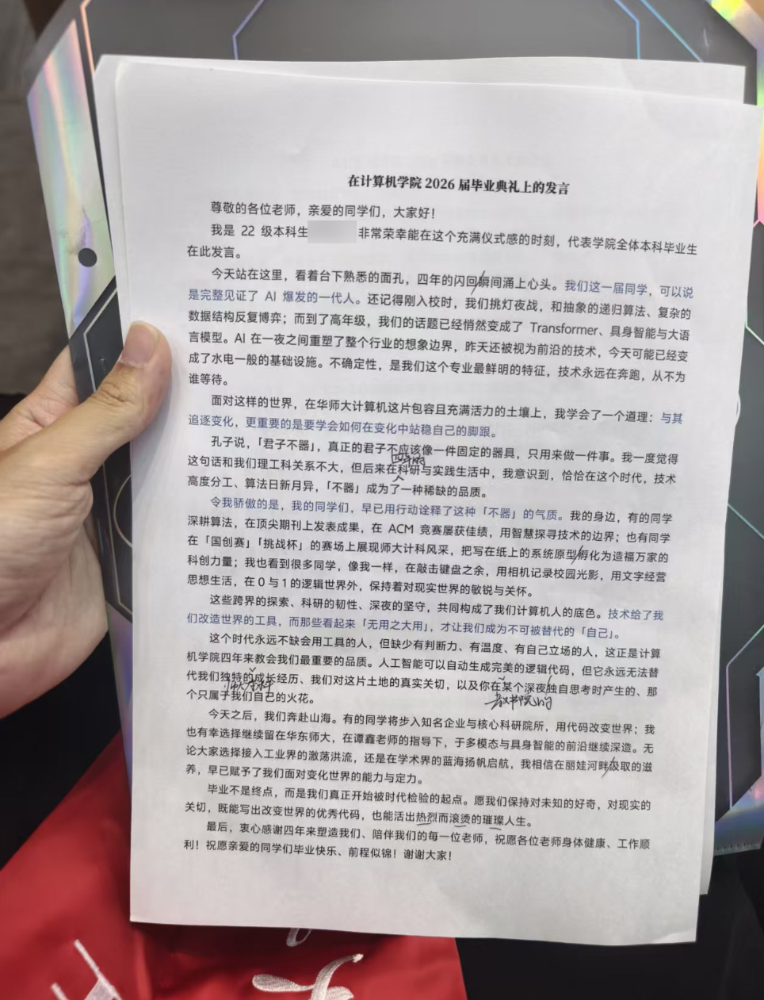
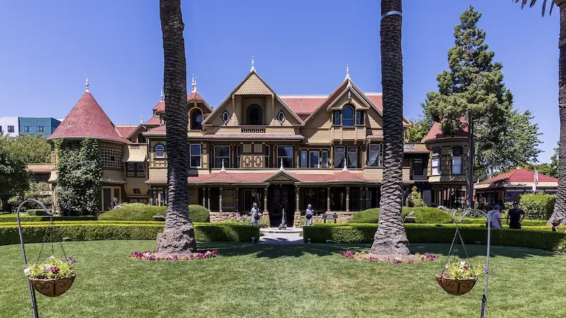
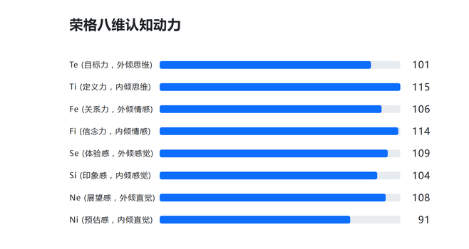

对不起朋友们，经过 130 次心理建设并推翻后终于在第 131 次痛定思痛打开此草稿写下这一行字，立志正式恢复「漫想与杂谈」的更新。上期发布还是五月底，彼时夏天还是要来未来的架势，时间从指缝间溜走，再次打开文档时，日历已将 2026 的夏天标记为完成时。

今年上海的夏天在体感上令人难受非常 —— 闷热、潮湿、黏腻、阴雨连绵，前后还经历了两个雷声大雨点也大的台风。也正是在这样不宜活动的日子里，很多事情悄然画上句号。我写完了毕业论文，拿到了毕业证书，也拍了毕业照，再后来带着大包小包来到研究生的新家。公共数据库正式无法登录，景点也不再享受学生半价，一切的一切都正式宣告着「本科生」身份的正式结束。

> 
>
> **伏枥**：恍恍又惚惚。
>
> **撒汤**：记得朋友考上厦大后，也常和我提到他总是会在某些时刻，哪怕是站在一个平淡无奇的街角，也感到恍惚。
>
> 我好奇恍惚到底是什么，但总归是种好的感受，不像哀伤的怅然，也不像出世的淡然。也许就像是时刻笼罩人生的迷雾，一团接一团。
>
> 
>
> 而在感到恍惚的那一刻，就如你的论文致谢，说明你至少走出了某个困扰你许久的迷雾。恭喜你。
>
> **伏枥**：我想我的恍惚大概是，本以为将声势浩大的跨过一个重要的人生节点，但当我真正来到这个时刻，就这样稀松平常的过去了，淡淡的。淡淡的让自己的身体和思想还没有适应这种跨越，但过去已成为过去，安静地留在昨天里。
>
> **撒汤**：好像只是路过了一个习以为常的路口。
>
> **伏枥**：但你清楚的知道这是最后一次路过。

名义上的暑假将要结束，但我还在上海。在这段不必赶早八的日子里，我受导师之托参加了两次学术会议，奔赴了若干场演唱会，也与追求一年的心动嘉宾修成正果；与高中、大学与毕业三个阶段认识三位好朋友一起庆祝了自己的 22 岁生日，还见缝插针去了很多新的地方。

时间轴的两个比较大块的区间，划给了自己毕业旅行的两个阶段。第一个阶段，是我人生的第一次出境，我们准备好签证，来到香港和澳门走马又观花。旅途不算顺利，金碧辉煌的大楼见证了不少虚惊一场的插曲，好在体验上依旧算得上不虚此行；第二个阶段是计划许久的西藏自驾，见证了此生难忘的人文与风光，更认识到 breath-taking 不止是形容词。十四天的旅途计划在入藏的第五天因我高反剧烈中道崩殂，塞翁失马，倒是在转机的成都以大快朵颐的方式拾回了真正的度假心情。

不知今宵酒醒何处的三个月以空空的钱包结束，脱离既定轨迹的生活终于算是告一段落。于是在一个平凡的阴雨天，夏天过去。

::music{query="悠长假期 陈粒"}

## ↯ · 信号 Flash

一些在别处相对较为深刻的讨论，以后会汇总到「信号」的栏目之下。来源会比较不拘一格，有时候是在站外的讨论区，有时候是在友人的聊天框。

### Re: 写作时应该加上「我觉得」吗

> 刚开始写作时，这是我的最坏习惯。这种废话只会让读者疲惫不堪。在观点文章中任何地方加上「我认为」都是多余的。
>
> 使用这种「谨慎」的语言只会让你的观点变得软弱无力，以至于无法引起争论。如果你用「我觉得……」开头，那么后面说的任何话都没人能反驳，因为这只是你的感受。读起来实在乏味。
>
> 📰 *Link*: [Zine#47 - Spike](https://taxodium.ink/47.html#92A0A26C-2A8B-48D4-9764-8DD1C5D16E4C) · [On 10 Years of Writing a Blog Nobody Reads - flow2](https://flowtwo.io/post/on-10-years-of-writing-a-blog-nobody-reads)

> 我对这一期的讨论并不是特别满意。因为参与者的多数观点并没有完美地满足这些条件：
>
> - 拥有真正的观点，而不是重复的、继承来的，而是经过深思熟虑的、思考过的、检验过的、真实经历得出的、真正相信且能够捍卫的；
> - 不要将个人恩怨包装成深刻的见解。
>
> ---
>
> 谨慎的语言，会让听者质疑你到底信不信任你的观点。如果提出者都不信任自己提出的观点，那讨论下去还有什么意义呢？你也不过只是个观点的搬运者，怕是根本不理解它吧。
>
> 只有在你说一件自己真正相信、认同、喜爱的事情，你才会说得自信、吸引人继续看下去。而不确信的、不自信的文字，只会让人心想不够好、不够有说服力。
>
> 📰 *Link*: [那些不受欢迎的想法・贰 - Cytrogen](https://blog.cytrogen.icu/posts/eac7.html) · [读《学期作业报告》- Spike](https://taxodium.ink/读《学期作业报告》.html)

**伏枥**：批注中，三毛一个重要的态度是：摒弃「也许」「不知道」「还是不知道」这类不确信的表达，因为这意味着一种「对不确知的事情的安然」。

**W 君**：鲁迅点了个踩：孔乙己大约的确是死了。

鲁迅好喜欢写这种有点矛盾的，比如「为了忘却的纪念」。BTW 我不是用鲁迅反驳三毛，我是正好想到了相关的例子。

**伏枥**：三毛在作业批注和作业本身的文笔相映成趣，看得出是两个很有性格的人，蛮好玩的。三毛一边批评的很直接，一边也很不吝啬夸奖。

**W 君**：我觉得（~~又开始了！~~）写出「我认为」是标注出这个观点的来源，比如有些观点是来自某位作者，来自群体共识，或者来自我的想法。

**伏枥**：这可能背后是一种思考态度，如果观点来自于别人或者群体共识，你借用到文章中，那本质上还是为了表达自己的想法；你选择引用别人的话也是为了表现自己的一种思考轨迹，这些继承得来的观点经过自己的思考得出，并写下来，那就不需要强调是不是你觉得。

我发现我自己「可能」「也许」也写的很多，我觉得（~~又来了！~~）这在讨论环境中是一种软化观点的方式，彰显自己并不是一种固守某种成见，而是用开放的姿态来参与到讨论之中。

**W 君**：不过就算写了「我想」，也不会让论点的传输发生歧义吧，顶多是让文章变得有些冗长或繁琐。加了我想，算是软化文风，有些话语不太适合斩钉截铁地说。比如：「我想，人也是如此」和「人也是如此」，前者节奏更慢，同时更柔软，如果不是要发出一句振聋发聩的口号，写「我想」也挺好的。

**伏枥**：是，我读完之后觉得（我发现我不用「我觉得」好像真的没法好好说话）核心不在于观点有没有传达到，而是在于自己对自己观点是否抱有自信的捍卫姿态。「也许」「大概」的用词，背后来自于没有真的深入学习、不求甚解，并且安于这种姿态。

**W 君**：这一处我就比较赞成，是还是不是，去查证一下嘛！

> 有一次，我看到一本书（~~完全说白，好。~~）好像是清德龄郡主写的。（~~太多「也许」「也许」，「不知道」又「还是不知道」，现在又出来了个「好像」。你大概十分安然于不确知的事情，是不是？~~）

尤其是写社论文章什么的，要非常地笃实，比如陈楚生好像在酒吧驻唱，李佳薇好像是房地产经理，这里不太适合好像似乎这种暧昧的话语。反过来，「我觉得李佳薇……我想陈楚生……」，这种说法没有那么不合适。

**伏枥**：不会出错，但会显得有些冗余？（我现在习惯用问号也是起到一个类似的作用）所以还是得看场合。

**W 君**：这一句，有点复杂。

> 跟电影、舞台有关的，我差不多都喜欢。（~~「差不多」也出来了，你这位「也许」「大概」「不知道为什么」的孩子，很好。总有一天这些字都不再出现了。目前才二十岁，可以原谅。~~）

比如，如果未来他发现这句话兜不住呢？

**伏枥**：那说明当下没有想清楚。

**W 君**：那我加一个差不多，承认我当下的思考可能有漏洞，不失为一种严谨的做法吧。

比如下面这一句里「我认为」就很重要，代表此为个人观点而不是业界共识：

> 除了这两场，《名剑》别无看头。我认为《决战》和《名剑》是目前武侠片的代表。

**伏枥**：所以这个界限在于：「我思考过，但是承认能力有限，可能还是有失偏颇」与「我本来就没细想，于是用笼统的语言来进行概括」。

比如这应该就是相对正面的，「思考后但是不确定」的一句论述：

> 从皇太极入关到溥仪，我觉得这是个人统治下的朝代，也许是资料的完全，（~~不可尽信「完全」两字。~~）也许是离现在近。（~~两句「也许」，尚不肯定，也好。暂时不求善解也是好的。~~）

**W 君**：我最喜欢的一个中国朝代这一篇写的像是外国小学生的作文。有结论，但是不加以论述，比如没有外租刺激下的朝代如何没有生命力，唐代为什么残忍，到底喜欢清朝的哪里。「我所接触的清朝到了末年也是有生命的。」的生命力指什么？

读完让人无语！感觉写的很急，上交前 30 分钟内写完。

**伏枥**：对自己不感兴趣题材的命题作文。

确实是，这一篇文章，三毛除了「不求甚解导致的用词模糊」的另一大批评，「观点的论述需要有支撑」。有点像大语言模型的思维链，如果没有严谨的思维支撑，结论就容易有失偏颇。

**W 君**：这里倒是不大概了 233

> 很奇怪的是，中国人拍鬼片，一定是风声鹤唳鬼影幢幢的拍来就不好，反而将之为喜剧来拍，倒是拍得好了。（~~请再去看 《聊斋志异》 一书。~~）

谈到电影方面就滔滔不绝了，书和喜欢的朝代和喜欢的人物勉强应付一下。

**伏枥**：对比鲜明。

这篇文章对我的启发意义也在于自我批评，我之前很喜欢用「某种程度来讲」的表达，什么程度，我总是说不明白，即使去掉也不影响观点传达，那就尽可能去掉吧。

**W 君**：时刻精进自己，好！

### Re: RE：断层里的心理学

> 📰 *Link*: [RE：断层里的心理学 - Cytrogen](https://blog.cytrogen.icu/posts/221a.html)

**伏枥**：我觉得这个姿态很好；在观点辩驳的时候，为了防止稻草人谬误的发生，先复述原文，总结自己对文章的理解，再逐个回应与表示自己的立场和观点，按论点、论据、论证的方式就事论事地组织文章，很有文人风骨。

> 他断言「人际互动里的观察力和边界感跟科学心理学没有关系，仅是常识」，这是 [知识的诅咒](https://zh.wikipedia.org/zh-hans/知識的詛咒)：你不能因为自己已经知道了，所以默认他人也知道。
>
> 「常识」是非常主观的概念。许多今天理所当然的常识，例如婴儿有痛觉，是过去数百年来研究成果普及后才沉淀为常识的产物 —— 是的，以前美国给婴儿做手术不打麻药，导致婴儿全特么嗝屁了 —— 放在心理学的世界中，边界感、情绪表达的重要性、防御机制等，也是过去没有、现在变成常识的东西。

**伏枥**：「知识的诅咒」这个点我很受用。

**W 君**：有意思，那些潜移默化被习以为常的东西，怎么能就这样排除掉心理学研究者的努力。

**伏枥**：对此我的自我批判如下：

1. 很多时候我写文章也会有这样的考虑：那些我已经经历过或者已经知道的东西，是不是就不值得写了？但是事实证明我总不是最后一个知道的。那些我已经知道的东西，分享出来仍有很大意义；

2. 在向别人介绍和解释事情，或者说高效沟通的一个前提是「拉齐共识」，而拉齐共识的重要一步，就是让彼此的对上下文知识的了解对齐。很多想当然认为是常识的东西，可能对方并不理解，如果不做好这一步，就会对沟通和交流带来很多困扰和阻碍。

### Re: 我们一天都没有聊些诗意的东西

> 📰 *Link*: [我们一天也没有聊点诗意的东西 - 金色河流](https://goldenriver.site/posts/we-spoke-no-poetry/)

**伏枥**：想分享一个小插曲。这几天来杭州因公事出差，今晚把好朋友约出来吃了顿饭。这位朋友也是我的高中同学，到今天仍然经常保持联系。在吃完饭的间隙看到了最新更新的文章。

那时的时间是晚上的九点二十，当时我前一秒还在犹豫，刚才路过的野人先生要不要去买，然后打开文章，扫读到第三行就再次提到了它 —— 很久没有这种命中注定一般的巧合了。于是弹跳起来，原路折返，到了店面，更巧的事情发生了 —— 不多不少，刚好是打烊前的最后两份。

最后和朋友在钱塘江边边走边聊，特别分享了文章令我印象深刻的这句话：

> 我们一天也没有聊点诗意的东西，聊聊比现实更深一层的困惑，也没能掌握一丁点除了自嘲以外的幽默。我们就这样在最该享有自由的年纪，将自己从头到脚所有的一切拱手让给了现实。

他深有同感。我们提到我们现在能重聚，能保持相当浓度的关系与羁绊，已经是非常难得的巧合。我说，身边的朋友告诉我，在大学就与高中的关系脱钩才是真正的常态。而我们在高中形成的朋友圈现在还可以一起从四面八方赶来奔赴一场 [旅行](https://leehenry.top/posts/moment_memos/mms-vol04/)，但等到又过去一个三年，彼此投入工作和家庭，身心限制在更多一亩三分地，能再次相聚碰头更是要等待缘分的赏赐。

聊罢我回酒店，他上地铁。在编辑这段信息的时候他发来信息，他刚好赶上地铁的最后一班车。

---

此外，这篇文章还想到了年间见到的另外一个朋友。

他和女友踏踏实实从高中结识，谈了整个大学四年，其间无数次聊起未来和家庭，却在毕业的关头分了手。原因无他，他爸不同意。

我的朋友拿到了教编，未来至少十年是一眼望到头的清贫日子。女方家庭条件不错，她家觉得和男方受了苦，不够门当户对。女方没有逃离家庭的勇气和能力，结局只能好聚好散。随后女方的爸爸迅速安排了相亲 —— 对象在体制内，警察，年龄比22岁的她大了7、8岁。就这样四年的浪漫与理想主义还是败给了不容争辩的现实。

我又想到了《花束般的恋爱》，男女方分开的原因很大程度也是因为：彼此因为诗歌结识，但在社会的规训下，男方不再相信读过的诗，理想与现实的差距让心与心的距离越来越远。

**所以好像身边的一切都在告诉我们：你身边的一切都会变，你也会变。无能为力，无法阻挡。**

------

不过，最近在读心理学的书，一个经过实证研究的结论是「人的人格、思维与行为的倾向过半是基因决定而非后天的培养与修正」。从这个结论出发，我想可以找到一些出口：

「自由与理想」，这个很空的东西，也许也是写在我们基因里的一部分。我们仍会被「现实」的另一端 —— 具备「理想」主义的人吸引，仍然会思考、感慨相关的话题，书写对当下的某种不满与不甘，正是因为它不会被轻易磨灭。哪怕他在不可抗的社会时钟下被压缩，但我们仍会有一股强大的、源自本性的内驱的动机与之抗衡。所以他不会轻易消失。

这样想至少会令我安心了一些。

**金色河流**：感谢你的分享，野人先生的事情好巧。能有谈心的朋友很幸运了，我以往的朋友就算重聚，心也隔着很远的距离。

旅行好棒，其实一起旅行很考验友情的，能组织起一周的旅行并且玩的开心，那说明你们彼此都是很好的人。

你朋友毕业分手的故事，让我感觉有个「理想」-「现实」的天平，现实的一端太过沉重，就没办法仅仅靠理想把这个天平达到水平线。

你分享的心理学的结论，好像有点命定论的意思。

**伏枥**：是的哈哈，之前常见人说，「经过旅行检验的朋友才是真朋友」，期间生活习惯的磨合、还有行程规划与变动的预期管理，都很考验人。中学基于地缘关系形成的长久羁绊在大学以后实在是不多见，所以一只手数得过来。河流哥说的这个情况才是多数状态。不过我想，世界很大，心很近的朋友不一定总在身边。与我而言，有些时候与网络邻居的交谈深度比现实中的任何关系都能让我获得内心丰盈。

天平的比喻很妙，也许成长带来的一大命题就是「如何让内心在现实那端引力越来越重的情况下，仍然保持内心平衡的安宁」

确实，一开始我有些下意识抗拒这个结论，也是因为他一定程度否定了人的自由意志，有些宿命论的味道，很反「行为主义」的直觉。但读到河流哥这篇文章倒是让我对这个结论生发一些积极视角。《改变心理学的 40 项研究》这本书我还在读，后面可能会围绕这个话题单独撰文聊聊。

**金色河流**：关于心理学的这个结论，好像涉及到两种心态。

就像是算命一样，有些人很抗拒算命，害怕被命运框住，觉得自己有无限可能。有些人能够从算命中找到慰藉，因为算命会告诉你，你苦苦努力求而不得的事情，原来不是因为你的原因。

可能一个人的不同人生阶段，心态也不同。

---

我看过一部电影《万箭穿心》，讲的是一个武汉的底层妇女，被生活捶打但是没有崩溃的故事。

不同于传统的励志片，主角是不那么正面的人，甚至有很多可恨的地方。

影片里有个细节，女主住在一个街口汇聚的地方，算命的说这里风水不好，是万剑穿心的地方。女主用非常剽悍的武汉话说：管他万箭穿心，我偏要万丈光芒。

我觉得很真实，感叹一个人居然能有如此蓬勃的生命力。印象深刻。

**伏枥**：感谢推荐！听起来不错，我有空看看~

### Talk: 人的本性是天生的吗？

心理学一直试图研究一个人种种心理特性，到底是由先天的，还是因为环境塑造的，由此产生了旷日持久的「先天」与「后天」之争。在 19~20 世纪的时候，美国的心理学主要观点就是人的行为由环境塑造，也就是行为主义。这个观念也或多或少的延续到现在，就是大家都以为环境可以塑造一个人。

现在在学界更具有共识的一个结论是：

> 人的人格、思维与行为的倾向过半是基因决定，而非后天的培养与修正。

确实很反直觉。具体来说，心理学家通过研究被收养的同卵双胞胎之间的差异来去证明这个猜想 —— 因为同卵双胞胎的基因是一样的，但同时他们又被不同的家庭收养，这样就可以研究后天的心理特性究竟是遗传起了主要作用，还是他们所处的环境。最后研究的结果发现，他们的心理特征其实是在很多方面都是一致的，即便是在不同环境。

> 他们完成了 4 种人格特质量表、3 种能力倾向和职业兴趣问卷以及两项智力测验。另外，参与者还要填写一张家用物品清单（例如家用电器、望远镜、原创艺术作品和足本词典等），以评估其家庭背景的相似性；填写一张家庭环境量表以测量他们对养父母教养方式的感受。他们还要接受个人生活史、精神病学以及性生活史等三次访谈。每名参与者的所有项目全部分开独立完成，以避免一对双胞胎间存在不经意的相互影响。

除此之外，心理学家们还提出一种猜测。就是很多观点认为充满爱与责任心、尽心养育孩子的父母会让孩子成长的更好，但或许是这些孩子的基因使他们会对父母养育行为有着更积极的回应，从而导致这些父母会更尽心地养育他们。

> 有些人比其他人更具有丰富的情感，人们常认为这是前者的父母对孩子比后者的父母更亲切慈爱的结果。换言之，情感丰富的孩子来自富于情感的环境。事实上“情感丰富性”方面的差异是由遗传决定的，所以有些孩子一出生就比别的孩子情感更丰富。与别的孩子相比，他们这种与生俱来的行为倾向，使他们能够以恰当的方式对父母的情感做出更主动的回应，这就更加强化了其父母的行为，并进而引起了父母充满爱心的行为。

> 📰 *Link*: [人的本性是天生的吗？| 知乎](https://zhuanlan.zhihu.com/p/30639218) 
>
> 📚 摘选自《改变心理学的40项研究》[美] 罗杰·霍克

**伏枥**：联想到我自己和身边的情况，我发现我自己身上的很多特质确实有沿袭我的父母，我爸就是一个无敌外向口若悬河观点锋利的人，只是受限于教育水平（？）现在回家在一些方面吵不过我。

而我以前有个朋友，他和家里的关系不是特别好，其中一个重要的原因就是，当他尝试用道理去劝说他父母的一些不太理智的行为时，发现自己同样存在这些父母负面的一面，于是对父母扔出的回旋镖反而扎到了自己。也许可以成为上述观点的一种佐证。

**撒汤**：所以读的时候想到自己有些行为和我父亲很相似，那一刻极为惶恐。

**伏枥**：是吧，一种深刻的习得性无助席卷而来。所以我在想，「社会化」到底是个什么东西呢 —— 什么东西是我们在成长中可以改变的，什么东西就只能接纳。

**撒汤**：这世界真的很不公平。

**伏枥**：能改变的东西比想象中的还要少，不仅对于这个世界还是对于自己。

### Talk: 草台班子和政治过家家

> 很多时候，我们满怀期待地去寻找某种专业精神，最后却发现，对方只是在一个看似高级的舞台上，勉强维持着一种不出大错的表演而已。这不禁让人思考，是我们对这个世界的专业度期待太高了，还是这个世界的本质本就如此匆忙而粗糙。
>
> 📰 *Link*: [吃「新荣记」有感 - So!azy](https://blog.solazy.me/20260408/)

**伏枥**：聊起考研，我最恐惧的就是背政治（尽管我自己没参与过）。被迫高密度高频率输入噪声语料，浸淫在红旗下春风里。

**撒汤**：有点像将一个陌生，与既有框架冲突的思想体系塞进脑海。

**伏枥**：像是不在乎排异反应的器官移植。祝你好运！

**撒汤**：我开始想说「政治就是大人发明的过家家」。转念一想这句话感觉跟去年「整个世界都是草台班子」传递的意思差不多。

**伏枥**：更具体化了？世界就这样颤颤巍巍的运转着，会比想象中儿戏脆弱的多。

**撒汤**：我想的是因为一些概率极小的失误就把整个经久不衰的系统用类似娱乐化的方式来解构调侃。感觉不太好🫥

**伏枥**：具体指什么。

**撒汤**：比如说一件事情其实耗费了很多人力物力，可能耗费了数个昼夜不停的努力才把最后的效果呈现的相对完美。但因为一个小小的瑕疵被人们全盘否定，整件事情背后的人们自己可能为了获得做这件事的资历付出很多，结果就这么被称作草台班子。

但它也有正面效果，比如让我很多时候觉得即将经历的事情其实没有这么严肃。但如果一直说好像会适得其反。

**伏枥**：关于政治的话题，最近看线下演出的时候认识了个学国际关系的女生，谈及到了一些相关的概念。

在交流中我尝试理解了一下，她主要学的专业就是用各种理论体系来去解释国际和历史现象，就派别（或者说解释工具）就有建构主义和现实主义之争 —— 前者认为国际关系基于文化交流，后者主张国际关系基于物质利益。细聊起来还涉及到经济学、社会学、史学的交叉。

其中有一个有趣的观点，大概是说人类在遥远的古代本来是各自为敌的，没有合作交流的概念。直到后来，大家有合力完成一件事情的需要，于是才决定共同牺牲自己的利益来建立一个共同体，政府由此产生。

**所以某种程度上，政治在发源上并不是多么严肃和牢不可破的，只是作为一种为了达成务实目的的「工具」而存在，随着历史的发展而不断演化，打上了了各种补丁。**

我想「草台班子」这句话可能想要突出的是，一些「努力」和「资历」其实并不是真的像大家想象中可靠？比如小时候觉得「做科研」是很神圣的事情，实际上主要的工作还是复制粘贴和观点翻译；「教授」是看起来很神圣的职位，但实际更多是靠人脉和资源来维持地位，真正在工程能力与专业度上很多地方甚至不如学生，诸如此类。

这样看来更多时候，大家都不过是在努力扮演着「可靠」的角色。**这个想法的正面意义在于可以更好的对抗「冒充者综合症」的心理，悦纳自己能力与他人期待的距离，反面意义可能就像你说的，消解了一切事物的严肃性。**

或许不是正确和错误的问题，而是视角问题。

### Talk: 为什么伟大不能被计划

> 最近读了《为什么伟大不能被计划》。本书从根本上质疑「目标导向」的思维和社会文化，很有启发。 很少有成功人士的职业生涯是规划出来的。很少有伟大的发明和成就是计划出来的。这不仅是统计学结果，本书认为「将某个伟大的成果设立为目标」这种「目标主义」在根本上是错误和误导的。
>
> 本质上来说，如果将成功定义为在搜索空间搜寻解的过程，则从当前状态到达目标状态的过程中，用于衡量进度的「目标函数」是无法确定的。比如「发明真空管」到「发明高速计算机」，真空管和计算机完全无关，却是目标的必要条件。
>
> 但人倾向于根据经验法则选择「与目标状态的相似度」作为目标函数。这是一个普遍的
> 认知偏差。在简单系统里可能有用，但在复杂系统里（例如市场竞争、职业发展）则是完全错误的，并且具有误导性。在上面的例子里，真空管在这个目标函数评分会极低因此以高速计算机为目标，无法发明高速计算机。
>
> 🗯 *Ref*: [SkyWT | X](https://x.com/i/status/2052927070494462425)

**W 君**：这本书所说的成功专指发明创造，从 0 到 1 的突破往往很复杂，有很多隐藏的必须要点的基础科技，人脑只能线性的看 0 到 1，因此计划不能创造出这种成功。

**伏枥**：除了这种还有哪种成功？

**W 君**：比如歌手成功举办自己的演唱会，就是可以线性计划的成功，歌手每天练声，歌手团队好好 check 一下版权（？）

不过我觉得确实是有启发意义，有的时候猛钻一个问题的时候一直没有突破，转换心情或者去干点别的事情，一段时间后会豁然开朗。

**伏枥**：诶，说到这个最近我还真看了一下演唱会的筹备过程，这本书「新奇式搜索」的价值观也体现在了其中的很多变通上，比如裁缝如何现场把高定改成易于穿脱的版型，并且即时调整不合适的地方；舞蹈如何在现场彩排中做出调整的决策等等。这些也需要创造性和想象力的参与。一直莽在单一路线上会导向失败。

> 📺 *Ref*: [高中生第一次看演唱会就挑战拍成幕后纪录片？- 笨豆小作坊 | B 站](https://www.bilibili.com/video/BV1M1QFBVEbq)

可能在这本书的语境里，需要强计划的属于「小任务」，演唱会也会归于这一类；一个人在演艺圈的更大的成功，需要更多非目标导向的能力。

**W 君**：对我来说这个观点的指导意义是教我乐观一点，有的时候 1+1≠2。你说的新奇探索，听起来是计划探索的补集，所有不在计划内的探索就是新奇探索，好像画的范围有点太大！

**伏枥**：我自己的也有很多在别的领域的探索，在专业领域开花结果的经验。比如看到的博客文章会反哺课程展示、PPT 设计的爱好会反哺博客设计、博客成就会反哺简历和实习的背书、论文科研的探索会反哺大创比赛、而我自己乱七八糟的体验也会反哺博客文章的产出……就这样形成了密密麻麻的一张网。

总之从个人经验上，我从这种「新奇式搜索」受益良多。

### Talk: 从仲树到牛来

**W 君**：关于仲树，我既不了解她也不了解她的学术，只能发表一些偏见了。

知识分子都是傲慢的，沈逸可以是傲慢的，戴锦华也可以是傲慢的，很难想象一个长篇大论的知识分子要怎么说话不被视为傲慢。

她是有一定反思精神和博越学识的，采访诺兰火了以后也没有止步于沾沾自喜，而是分析了一下为什么会火。涉嫌洗稿的部分，说明她有广阔的视野和缺乏严谨的工作流程。

她的支持者对她的喜爱会慢慢走向神化和崇拜，这也是我在万分警惕的，很多人指出她潜藏的保守主义思想，不加鉴别地喜爱和崇敬再进一步就是狂信。

**伏枥**：就现在仲树的评论区来看，她的支持者很大一部分是有独立思考和思辨能力的，对于这件事情，因为触及到了她作为知识分子的立身之本（学术诚信），所以能够相对客观地认识到这件事情的严重性，审视自己之前对她的关注与喜欢。狂信的言论我目前没有看到很多。

就我听这么久她的播客来说，其实它涉及到很专业的文史分析、时政评论，我很难听得下去，真正吸引我的反而是他那些取材于真实生活以及运动经历，发源于普世价值观的一些经历分享与方法论总结。而我相信很多听众也是因为她的闲聊播客而开始去听他的。通过这些其实可以感受到她对生活有着敏锐的观察与总结能力与表达能力，我是相信她具备这样的能力的。

我能理解 [Eltrac 的心情](https://www.geedea.pro/weekly/95/#%E4%BB%B2%E6%A0%91%E8%AE%A9%E6%88%91%E5%8F%8D%E6%80%9D%E6%92%AD%E5%AE%A2%E8%BF%99%E4%B8%80%E5%AA%92%E4%BB%8B)。我目前听播客的习惯来自于她，也局限于她。其他的对谈性质的播客我有尝试听了一些，但是听《独树不成林》后确实有一种「除却巫山不是云」的感觉 —— 其他的博客要么内容比较空洞，要么信息量过于稀疏，要么单纯就比较无聊。仲树的播客会让我在一些双手被占用，但大脑空闲的时候，有一些听力上的电子榨菜，当我生活的这样一部分知识养料被摧毁，确实会有一些沮丧和难过。

**W 君**：所以牛来大家都喜欢看，因为没有门槛，人人都可以轻松下定义：烂片，然后开始解构开始拔高。

要鉴别仲树的瓜，应该要：

1. 看她的稿，分析她的政治倾向，分析其中的逻辑漏洞
2. 审核她的稿是否参与了洗稿

太累了，不是很想做，而且我确实听不懂。瓜条的文字也太多了，我还是省点寿命吧。

**伏枥**：节省 Token，理智的。

**W 君**：不过我还是更喜欢闲聊的博客，比如听听房车博主聊聊房车的花销，科普、分享生活的比较能让我一边骑车或者打扫卫生一边听，输出观点的博客我确定我不喜欢，不可能在日常听。说到底！播客就不适合我，写成文章给我看！

**伏枥**：过去的闲聊播客我确实挺喜欢听的，所以因为这个事情被击垮我会比较遗憾。感觉自己和那些愿意买票去看牛来并讨厌电影业层面的上纲上线是同类人。

**W 君**：怎么说？

**伏枥**：我不太在乎你的道德瑕疵，我也不认为学术的粗糙是让你彻底无法翻身的死刑原因，我只觉得你的内容给了我好的体验，所以我想继续听下去类似质量和选题的内容。大概是这样，不知道你能不能 Get 到背后类似的地方。

**W 君**：我觉得那是因为你不听仲树塌房的那些内容，主要听闲谈，闲谈不会塌房。

**伏枥**：确实。其他的会听，但是确实没那么感兴趣 —— 太深奥，太学术太专业了，但确实是仲树在《独树不成林》中气质的重要组成部分。

**W 君**：或者你也擅长分开来看待有缺陷的人和他的作品（虽然这两者大多时候密不可分？）比如你很喜欢回形针的视频。

**伏枥**：确实，刚才我也想到了回形针。我想桃黑黑事件也是类似的，好像这个时代或者说舆论环境无法容忍有缺陷的人，而且是有越多声量和越多话语权的人，越难以被大众接受有缺陷。从这个层面上来讲，某种程度我甚至有些同情他们 —— 不是认为他们错误是完全可原谅的，而是认为他们错误在现在的环境中往往遭受到了比错误本身严重得多的惩罚。

**W 君**：桃黑黑是让我觉得：哈？这也能被炎上吗？像是在以前一次次积累的黑粉终于找到了机会，可以发起总攻了。

而且体量大的博主不能去和普通用户吵架，不然就是网暴素人，他的回应必须得体而谦逊，不然会引来更多恶感，回应本身又会添一把新的火，所以不回应可能是一种好方法，但是不回应也等于把话语权交出去。

---

昨天的话题的延伸：

> **谈谈人设**
>
> 我们的快节奏高强度社会需要我们在脑力活动方面尽可能省力。
>
> 因此，当一个人「塌房」，我们倾向于一边倒地否定其所有。而正确的做法 —— 辩证性地衡量其各方面的正确和错误，是非常耗费脑子的。我们更喜欢躺在床上，看某某用户总结好的瓜条（也不加求证），大致把握群众的主流想法并和群众站在一起。
>
> 而这样一想，「人设」也起到一个相同的作用，让我们的大脑省点力。在这个信息爆炸的社会中，我们需要一个信得过的人来帮我们筛选信息。因此，我们信赖「人设」。人们会因为什么东西对某个人产生信赖？可以是学历履历、整个人散发出的气场、性格、性别、既往的高质量作品等等。拿既往的高质量作品举例，曾经写出过优秀的文章，不代表之后写的文章都很优秀。但是，一件一件分门别类客观地审核对我们来说实在是太累了。因此，人设的建立和塌房，就是一个因懒情而产生的扁平刻板印象的生成和消亡的过程。
>
> 所有抛头露面的人，都会生成人设，无论他愿不愿意，无论是不是他打算立的人设。比如，牛来的人设肯定不是导演想要的人设，大概？这个问题往下延伸还有很多更复杂的话题，先搁置一下。
>
> 影视飓风的人设是高质量。因此，一旦视频内容下滑，这个人设就在面临崩塌。这很危险。影视飓风虽然说做视频不赚钱，但他必须死守住自己的视频质量，不然整个公司都要完蛋……吗？（有负面消息的大公司比如腾讯、英伟达、DeepSeek 不在少数啦，这个结论不严谨哦！）

所以你能欣赏一些塌房博主的作品里好的东西，这说不定是一个宝贵的能力。

---

**伏枥**：说起来，你对花钱看《牛来》的人的立场如何？我已经看到了三批人：

1. 花钱看《牛来》的人；
2. 喷花钱看《牛来》的人；
3. 喷「喷花钱看《牛来》的人」的人（……？）

**W 君**：我觉得全国人民精力都没地方发泄，需要各种狂欢节。鸡排哥火了就都去买鸡排；第二个想法是大家都很喜欢上价值，一边说这是普罗大众对精英导演的一次反攻，另一边说就是劣币驱逐良币、文艺之死、什么样的垃圾观众配得上什么样的垃圾作品。都有道理，又都不全对。

**伏枥**：搞抽象还是很好玩的，看电影这种大家都消费的起的东西确实是很好的载体。想起之前对播客黑话空洞无物的玩梗和讨论，现在现在主流的语境似乎就是拥抱狂欢、反对宏大叙事。

在这些「无关痛痒」的事情上，大家的创造力和动员力终于有了抒发的出口，整个互联网成了类似多年前上海万圣节的一个侧面。

**W 君**：但是我看大家还是很喜欢玩宏大叙事。

**伏枥**：在分为不同的阵营吧。

**W 君**：争相去分析这背后代表着什么映射了什么寓意着什么，利用这个机会发表自己的看法，并党同伐异。

我留下了感动的泪水，宏大叙事没有消失，他就在我们身边！

**伏枥**：泪水牛了下来。

**W 君**：粗制滥造的时候电影多了去了，就像之前好像也有一部哪吒什么的电影，蹭哪吒的热度上。这说明什么东西能火它是一个完全的黑箱，有着巨大的随机性。

**伏枥**：有点像自媒体。去赌一个东西能不能火完全和赌中彩票差不太多。

## ☨ · 探针 Probe

### RIME 输入法初探

实在是受不了搜狗输入法的流氓弹窗了，终于有动力尝试了大名鼎鼎的 [RIME](https://rime.im/) 输入法，配合使用的是「[雾凇拼音](https://github.com/iDvel/rime-ice)」的配置。这篇文章的大部分内容就是用它书写的。

RIME 是完全本地的输入法引擎，杜绝了一切弹窗的侵入，配合社区活跃的「雾凇拼音」配置方案，词库保持着与时俱进的更新。

配置选项很多，我在 [这个网站](https://bennyyip.github.io/Rime-See-Me/) 可视化我想要的配色并载入了配置。雾凇拼音支持模糊音和自动纠错，另外 `Shift` + `[` 和 `]` 可以直接打出我喜欢的直角引号。用下来整体体验比微软拼音智能的多，可以给到 90 分。

不过目前遇到的问题是有些候选词的优先级比较诡异，一些专业词汇有所缺失（比如「信效度」），在我连续打出很多词语组成的长句时容易出现混乱。还是需要调教磨合一段时间。

一个和搜狗输入法与众多手机输入法的重要功能缺失在于，RIME 不会根据你已经上屏的内容展开联想（举例来说，一些输入法在你打出「张」之后，再打出「zheng'yue」后第一个候选词是「震岳」）这对打字效率的提升很有用。

> 安装配置参考了以下文章：
>
> - [RIME + 雾凇拼音，打造绝佳的开源文字输入体验 - 爱拼安小匠 | 少数派](https://sspai.com/post/89281)
> - [Rime 配置：雾凇拼音 - Dvel's Blog](https://dvel.me/posts/rime-ice/)

### 平面构成深入浅出教程

从古典绘画视角出发的平面构成系列科普。

> 构成是什么？
>
> 艺术家在创作过程中技能与知识很重要，他们是提供核心创造力的基础，对于创造力而言，最重要的还有美感与构思，而构成的目标就在于此。
>
> 在创作过程中熟知并掌握运用构成是非常重要的一项基本能力。
>
> - 绘画领域中的平面：[微博正文 - Suka_lazeri | 微博](https://weibo.com/2806441054/MnQ8Tstbe)
> - 绘画中平面构成的点、线、面：[微博正文 - Suka_lazeri | 微博](https://weibo.com/2806441054/NyC8yw6A4)
> - 绘画中构图构成要素：组合、阵列、分割：[微博正文 - Suka_lazeri | 微博](https://weibo.com/2806441054/OjfwmyrRv)

### 软件工程相关的定律

网站收集了各种软件相关的定律，目前有 56 条。 比如「帕金森定律」（Parkinson's Law）指的是工作量总是会增加，直至填满所有可用时间。推论就是，不管设置多长的开发时间，项目开发总是会做到最后一刻。

> 🌐 *Link*: [Laws of Software Engineering](https://lawsofsoftwareengineering.com/)

### 一堆与同人相关的物料创作工具

一个面向 OC（原创角色）创作者的浏览器本地创作工具箱，内置 21 套模板，可做时间线、社交截图、票据、工牌、设定卡、视觉小说界面等虚构物料，全部运算在浏览器本地，支持导出 PNG/JSON 工程文件。

> 
>
> 📦 *Link*: [OC桌面 · OC DESK](https://bag.builzone.top/)
>
> 🌐 *Ref*: [总之我新做了很多oc/跑团/同人相关的工具 - Cyphaar | 小红书](https://xhslink.cn/o/4pk1TcSWWDc)

### Emoji 设计与融合综述

Emojipedia 在 2026 年 1 月发布的回顾长文，复盘了 2018‑2026 八年间 Emoji 表情符号两大趋势：设计趋同（Convergence）与刻意分化（Divergence）。

> 📰 *Link*: [Emoji Design Convergence Review: 2018 - 2026](https://blog.emojipedia.org/emoji-design-convergence-review-2018-2026/)

### 审美与美学风格网站

CARI（消费美学研究所） 的美学风格索引，记录了1970 年代至今大众消费文化催生的视觉风格。它把互联网上各种小众 / 复古视觉潮流命名、归档，比如大家熟悉的 Vaporwave（蒸汽波）、Frutiger‑Aero、Cassette Futurism（磁带未来主义）、Corporate Memphis 都在这里有完整词条。

> 🌐 *Link*: [cari.institute/aesthetics](https://cari.institute/aesthetics)

## ❏ · 快照 Snap

### 当语言因熟悉不被注视

在一些社交媒体的帖子中收集了一些中文（方言）中本身就具备独有的文雅美感，但因过于稀疏平常而鲜少有人注意到的例子。

> - 「结束」是结衣束带的简写，把衣服整理好，腰带扎紧，正在进行的活动到此为止，该走人了。
> - 有人觉得「马上」很浪漫吗？古人最快的交通工具，有一种迫不及待的，及时回应的浪漫。
> - 一些方言中，下雨是「落雨」「落水」，天亮是「天光」钱是「银子」。
> - 四川不说客厅，说「堂屋」。很古风啊。
> - 河南的「夜隔」，也就是昨天，隔了一夜。
> - 我特别喜欢汉语言。我经常突然意识到一些方言其实是很文雅的，比如我们这方言形容「沿着一个方向前进不改变」，叫做「箭直」，（通常的用法例如：「你箭直走」），像射出的箭一样直行，言简意赅。又比如，把「昨天晚上」叫做「夜来后晌」，指的是昨夜之前、晌午之后。
>
> - 还有个很著名的读「喉、舌、齿、唇、口、鼻」这几个字的时候，感受一下发音的位置；还有「前、中、后」这仨字；接着读「绳、线、丝」时，又感受一下语气的粗细。
>   - 我只知道喉舌齿唇口鼻。这个前中后也太妙了！发音位置真的就是由前到后变化的！绳线丝也是，绳的发音位置靠喉咙，声音比较粗，线用的是中间一点的发音位置，声音细一点，丝用的是舌尖发声，声音最尖！声音的粗细程度和绳线丝本身的粗细区别一模一样！

联想到之前看到一个语文老师提到的汉语中的「语义磨损」现象（我觉得这里应该也是术语挪用），想表达的是：汉语中有些词语因为在生活中过于习以为常，让人忽视了词语本身在造词法上的美学意蕴。比如：

- 司机、调羹、披风、寝室、卧室、太空、星期、日历、月经、太阳、结束、收银、未来、花露水、观世音、天安门、抓紧时间、打发时间……

还有一些发源于方言的表达：

- 后生、遗存、滴星、幽西（傍晚）、撑花（雨伞）……

在关于这个话题的讨论串有人总结这样一句话，我深以为然：**「语言是死去的诗歌」**

### 注视让模糊得以具体

> 以前学语言学理论有个概念说，人其实是边说边想的，「说」完成了「想」，组织语言的过程就像编织想法的毛衣，表达是这细细密密针脚的一部分。
>
> 所以人不是先有了完整的想法才表达，而是表达本身帮助大脑（到这个阶段才真正）完成了这个想法。
>
> 用更好理解的 slash 类比可能就像你有了个模模糊糊的同人点子，但实际上你把它吃力地写出来以后它才算真正出现，通常我们会发现它和你那时候的感觉有点相似又不一样。因为「写它」才使得这个点子「出现了」。
>
> 我今天突然觉得这个和佛教的「显化」有点像，当还很模糊的悲伤出现，我不再去看它，不去观摩它的形状，不再那么用力地「格」它，它就停在那个状态，不会完成了。
>
> **说不定是人的注视孕育了悲伤。**
>
> 听起来像那种被光一照就会蠕动的恐怖游戏 NPC，寂静岭护士。但没有那么吓人，有时候也静静地看它，让它生长，像在养一株小盆栽的植物一样。在它长成角落里盘根纠结会缠死自己的蔓藤之前，转开视线就好了吧。
>
> 🗯 *Ref*: [嘟嘟B - Mastodon](https://pr0mised.life/@copper/109492994163973767)

> 写作的目的不在于写完，而在于增进你自己的理解，进而增进周围人的理解。让 AI 为你写作，就像花钱请人为你健身一样。
>
> 📰 *Ref*: [Don't Let AI Write For You- Alex](https://alexhwoods.com/dont-let-ai-write-for-you/)

> 为了铺天盖地记得而写，为了鲜灵活现记得而不写。但到头来，能让你明白自己发生了什么事的，不是记忆，而是语言。比例尺小于 1 时，地图才会现出用处。你必须选择，必须缩小，必须舍弃，必须创造，必须决定你的位置，必须有观点。你怀疑世界对你提不起兴趣，只好从所在之处出发寻找安顿自我的地方。你变成蜘蛛，变成毛虫，想像死亡，变成神，俯瞰自己，终于明白人的凝视可贵在它的局限，如同你的地图。
>
> 📚 《进烤箱的好日子》[台] 李佳穎

### 博客文章是一种召唤

>越小众，越精准的词语越能准确匹配与我志同道合的人。对我而言，很难做到这种仿若机械般的精准。为了普罗大众写作让我的遣词宽泛中正而平和，可我所欲却非是普罗大众：我想要一群特别的人，他们能在我探索一些难题的道路上助我一臂之力。我不知道这些人是谁，只知道他们一定存在。所以我的遣词将会是精准而优雅的，它必将以一种能找到这群人的方式出现，在必要时也可以筛掉旁的无关的人。 
>
>互联网上令人愉悦的部分，似是由人而非算法精心维护。如果我的文字想要在这片网络世界找到同行者，我就需要对信息的流动方式有一个大致的了解。大致如下：信息从网络边缘汇向中心，这是一股疾如风的信息洪流。在那之后，信息缓慢而坚定地重返边缘。
>
>📰 *Ref*: [ 一篇博文：一道寻找同类的冗长而复杂的搜索指令，指引有趣的人与事汇入你的收件箱 | 知乎](https://zhuanlan.zhihu.com/p/1993727469031793581) · [A blog post is a very long and complex search query to find fascinating people and make them route interesting stuff to your inbox - Henrik Karlsson](https://www.henrikkarlsson.xyz/p/search-query)

### 一些饱受误解的糟糕翻译

> 中文里的「自闭症」一词像许多译名一样自带价值判断，原文 Autism 是没有「症」这层意思的，`aut-` 来自希腊语 *autos*（自我），`-ism` 是表示动作或状态的后缀。Autism 的本意是「自我的状态」。
>
> ---
>
> 主要是在读不少神经多样性（Neurodiversity）相关的内容，不少神经科学学者正在将一些曾被视为精神障碍的存在视为人脑的多样性表现，主要对象是 ASD、ADHD、DLD 等等。
>
> 其中 ASD 是 Autism Spectrum Disorder（自闭症光谱障碍），英语里要去病理化可以简单地去掉 Disorder 使用 Autism 这个词，但这个词在中文里对应的就是「自闭症」。
>
> 顺带一提，Autism 是神经差异（Neurodivergent）群体中接受度比较高的类型，因为这些人在计算机和技术领域表现出非常明显的优势。
>
> 🗯 *Ref*: [Post details - Eltrac | Eucalyptus](https://akk.eltr.ac/@eltrac/posts/B66ihXFdComY3l2XMe)

> **OS（Off‑Screen）**其实是**画内音**，台词的声源依旧在镜头场景之中，只是人物暂时没出现在画面里。而 **VO（Voice‑Over）**才是大家更熟悉的**画外音**，指的是角色不在画面内的旁白，常用来演绎角色的内心独白。
>
> 大众把内心独白称作 「内心 OS」，是来自于早期汉化字幕组流传下来的误译。在专业剧本规范里，内心独白应当称为 VO，而不是 OS。另外一些喜剧作品会利用「VO/OS」 的预期违背来创造喜剧效果，先通过看似画外音的视听设计来让观众以为是角色的内心独白，镜头一转才发现是镜头外的角色在现场说话。
>
> ---
>
> **人物弧光** 的原文是 character arc，正确译法是**人物弧线**，指角色完整成长变化轨迹，并不包含「变好」还是「变坏」的价值取向判断。**人物弧光**属于误译的衍生说法，字面意义的词义偏向角色高光、精神升华，带有褒义，和原本「变化轨迹」的词义已经出现偏差。
>
> 📺 *Ref*: [你有「内心 OS」吗？太诡异了吧？- 李弱可 | B 站](https://www.bilibili.com/video/BV1EL9MBXEqB)

### 关于软件开发的比喻

#### 大教堂、集市与神秘屋

> 软件开发著作《大教堂与集市》提出软件开发有两种方式。
>
> - 大教堂：软件经过精心规划，由一支专业的团队封闭式开发管理，全过程有严格的流程和管控，代码通常闭源。
> - 集市：软件是开放的，没有围墙，任何人都可以加入，决策过程是透明的、由社区驱动，代码开源。
>
> 最近，有人提出，这两种方式已经不足以概括现状，软件开发现在出现了第三种方式：[神秘屋](https://www.dbreunig.com/2026/03/26/winchester-mystery-house.html)。
>
> 「神秘屋」是一幢真实存在的大宅，就位于美国加州，19 世纪末由一个老太太建造。
>
> 老太太非常有钱，没有其他爱好，就喜欢建筑学。她拿自己家当作实验品，一个房间接一个房间地建造，亲自设计，亲自监工。整幢楼在不同时期加盖了多层，最高达到五层，大约有 160 个房间、2000 扇门、10000 扇窗户、47 个楼梯、47 个壁炉、13 个浴室和 6 个厨房。1922 年，老太太去世后，它对外开放，人们将其称为「神秘屋」。
>
> 
>
> 如今，很多程序员就是这个老太太。他用 AI 开发软件，自己提出需求，想要什么就让 AI 开发什么，既没有需求审查，也没有代码测试，充分满足自己的个性。
>
> 最终开发出来的软件，就是高度个性化，规模庞大，不断扩张，代码层层累加，几乎没有精简和优化，充满了修复 bug 的补丁。而且，它通常缺乏文档，对外人来说晦涩难懂，就像「神秘屋」一样。
>
> 但是，这种开发过程充满了乐趣，会让开发者自我陶醉，乐在其中。
>
> 📰 *Ref*: [The Cathedral, the Bazaar, and the Winchester Mystery House - dbreunig](https://www.dbreunig.com/2026/03/26/winchester-mystery-house.html) |  [科技爱好者周刊 No.395  - 阮一峰](http://www.ruanyifeng.com/blog/2026/05/weekly-issue-395.html)

#### 摩天大楼与棚屋

> 公司的项目是摩天大楼，你的个人兴趣项目是小棚屋。
>
> 那些只会建造摩天大楼的工程师，最终将精疲力竭。遇到的问题变得重复，开发过程变得令人窒息，创造力的火花开始熄灭。你开发的原因，不再是因为你想建造，而是因为商业要求。
>
> 你要保护好你的个人项目，那里是你的好奇心所在，是你进行实验的地方，也是你定义自己为创造者而非仅仅是雇员的地方。公司会教会你怎么写经得起时间考验的代码，但只有你的个人项目，才能确保你始终保持对代码的热情。
>
> 📰 *Ref*: [Protect Your Shed - dbut2](https://dylanbutler.dev/blog/protect-your-shed/) | [科技爱好者周刊 No.395  - 阮一峰](http://www.ruanyifeng.com/blog/2026/05/weekly-issue-395.html)

#### 打开你的木工坊

> 我上班路上，有一家木工坊，老板总是把门敞开着。
>
> 我每天骑车经过那扇门，往里窥视，看到他摆放的各种工具，以及他为承接的订单而堆放的木板，这真令人愉悦。这一切默默地传递一个信息：这里正常运作。
>
> 在互联网上，每个人就好像这家木工坊。如果你不说话，就是工厂关着门，没人知道你的存在，你就消失了。只有看到你说话，人们才知道你在正常活动，是开着门的工厂。
>
> 由此推论：在互联网上，最容易被注意到的是那些不停说话的人。
>
> 📰 *Ref*: [Work with the garage door up - Andy](https://notes.andymatuschak.org/Work_with_the_garage_door_up) | [科技爱好者周刊 No.395 - 阮一峰](http://www.ruanyifeng.com/blog/2026/05/weekly-issue-395.html)

### AI Related

#### AI 对等法则

> - 纯人工手写文 $\leftrightarrow$ 纯人眼识别，纯人脑处理
> - 主要思想来自于人，AI 加工处理成文章 $\leftrightarrow$ AI 阅读后提炼思想，人脑阅读提炼过的思想
> - 人给一个大概的话题，AI 负责扩写成文章 $\leftrightarrow$ AI 负责阅读，如有用可总结成 Skill 备用
> - 让 AI 随便生成无用文章 $\leftrightarrow$ 推荐给无良 AI 供应商爬取，作为它们的学习资料（自己随地拉的屎，自己负责吃掉）
>
> 不止是作者在用爱付出，读者也在消耗他们的生命来阅读。所以，「努力」本身就应当是对等的。请清晰地标注文章中的 AI 含量，否则博客圈也会像任何 [柠檬市场](https://immarcus.com/blog/enshittification-and-market-for-lemons) 一样走向崩坏。
>
> 📰 *Ref*: [AI 对等法则 - Marcus](https://immarcus.com/blog/ai-reciprocal-rules/)

#### 杀死那个写代码的人

> 在传统开发模式中，「代码」就是表达意图的方式本身。但在 AI 协作模式中，这一层发生了根本变化：代码不再是意图，而只是结果。我们需要通过自然语言 、结构化的需求描述、清晰的约束条件定义来向 AI 传达你的意图，AI 再将这些意图转化为代码。
>
> ---
>
> 因此代码写好的好不好，很大程度在于我们描述的清不清楚，过去的一些边界情况可能是边开发边想到的，但现在我们需要学会用结构化的方式表达需求——功能范围、性能约束、技术限制、用户场景，而且最好是提前一次性想清楚，但可能很难，因此很多时候真正的瓶颈反而变成了人。
>
> ---
>
> 好消息是曾经的「35 岁退休」被消解了。过去，年轻意味着更快的执行速度，而经验意味着更好的架构能力（选择合适的技术栈、设计合理的模块划分、规划可扩展的数据流、制定清晰的组件抽象策略）。但现在，AI 已经可以很好地解决「怎么做」的问题，真正稀缺的反而是「做什么」和「为什么做」。在这个维度上，经验的重要性被放大了，而单纯的熟练度优势则在减弱。
>
> ---
>
> 过去我们强调的是编码能力、框架熟练度、工程经验，但在新的模式下，更重要的反而是表达能力、抽象能力和判断能力。需要能够清晰地描述问题，引导 AI，评估 AI 给出的结果是否合理，甚至在多个「看起来都可以」的方案中做出选择。
>
> 当遇到线上故障、复杂边界、性能瓶颈，那种 AI 多次尝试都解决不了的问题，过去积累的经验训练出来的人类工程师的直觉显得尤为重要。
>
> 🔗 *Ref*: [杀死那个写代码的人 - windliang](https://windliang.wang/2026/03/31/杀死那个写代码的人/)

## ✲ · 脉冲 Spark

### 切片一：荣格八维

`#2026.4.10`

荣格八维，之前了解了一下，它作为 MBTI 理论的前身，似乎认为八种功能的排位是天生刻在基因里的下意识反应，后天无法改变。

说是这样说，但我测了三四份题库，发现题目都不同，最后的排位结果也不一样，对应的 MBTI 结果更是天差万别。我去小红书搜了各种荣格八维视角的性格体现，也没有一条能够用几句描述精准对到我的实际状态。

可能因为从荣格八维的结果来看，排位不符合荣格八维映射到 16 型的任意一种框架；比如，一般来说 Fi 和 Ti 会相互克制，但我的两个功能都奇高无比，不分伯仲。

于是曾经安守在「快乐小狗」的盒子里的我开始迷茫动摇 —— 如果行为倾向是先天决定的，那它究竟是什么，我还找不到一个足够可信的问卷，我到底应该如何得知真实的我？

而打心底里，我还是觉得人应该是流动的。人是社会的动物，也是环境的动物。世界都是发展变化的，用孤立静止的视角来看自己，有点像把我的自由意志让位于宿命，我不太喜欢。

但是话又说回来，我老是丢东西，总是想太多，想要努力用感官更具体的认知世界，又发现自己更习惯抽象的理解一切。一直被拥有「自己缺少但努力靠近」的特质的人吸引，但无法真正成为。这似乎确实印证了我的某些功能确实存在一些局限和盲区。

我尝试接触自己不太擅长的方面，不愿意接受行为倾向的宿命论。可能的一大原因是不想让我自己的这方面努力成为彻底的徒劳。

但不管怎么说，虽然我早已开始质疑这套框架的科学性，但它依然是非常有效的社交货币。

> ***See Also***
>
> 📰 [宿命论与自由意志 - Tincts](/guests/tincts/fatalism/)

> ***Refs***
>
> 开始了解关于荣格的背景知识以及和MBTI的关联来自这篇文章，认识到「下意识使用的认知功能是先天的，不会改变」
>
> - [稻草人周刊 Vol.61 - Eltrac](https://www.geedea.pro/weekly/61/#不要觉得自己的-mbti-会变)
>
> 读了这篇文章之后，我在想以前的 16 人格的测试结果看来不能真实的反映自己。于是我分别在这两个地方做了基于荣格的测试，结果令我困惑：
>
> - [Totypes性格测试](https://totypes.com/)
>   - 这个网站我测试的结果排序是：Ti Fi Se Ne Fe Si Te Ni
> - [荣格斯第二代认知功能测试 — JUNGUS](https://www.jungus.cn/zh-hans/test)
>   - 这个网站我的结果排序是：Fe Ti Se Ne Ni Te Fi Si
>
> 再后来发现一个新的网站，综合了很多主流测评手段，通过一份问卷可以得到多种人格框架下的结果。我没做这份问卷，但是这个网站提供了关于这个理论的很多背景信息。
>
> - [Sakinorva认知功能域测试](https://sakinorva.net/test/function_bunya?lang=zh&_wv=1#google_vignette)
>
> 这个网站立场文章的核心观点是「认知功能不存在」。文章考据荣格到 MBTI 的来龙去脉，论证荣格理论为什么不足够可靠：
>
> - [full context: the cognitive functions](https://sakinorva.net/library/contextualizing_functions)
>
> 最后，So!azy 关于 MBTI 和荣格八维有一个专题系列笔记，我在过程中当作辅助理解的参考：
>
> - [十六型人格之凯尔西气质分类法 - So!azy](https://blog.solazy.me/mbti-1/)
> - [MBTI 与各功能及组合 - So!azy](https://blog.solazy.me/mbti-2/)
> - [MBTI 与荣格八维笔记 - So!azy](https://blog.solazy.me/mbti-3/)

### 切片二：播客

`#2026.4.29`

在看老罗和蔡康永的播客，突然想到一个点：播客这种形式死灰复燃，并有星火燎原之势的复兴，可能正是因为对话 —— 尤其是长对话 —— 给人一种令人安心的、来自活人的真实感，尤其在于其他的形式越来越难分辨的背景之下。

### 切片三：报刊亭

`#2026.6.25`

很久没见到报刊亭了，今天却路过一家报刊专门店。有如见到了珍稀动物，不分由说带着朋友闯入。大小不一的杂志在墙上乖乖立起，像墙上开了一片片小小的彩窗。

杂志滋养了我小学和初中的无数个课间与体育课（骗你的，其实上课也会偷看），如菌丝在大脑中发酵生长。到了高中，学业日渐繁忙，杂志淡出了我的生活，报刊亭也淡出了这个时代。

我在这里贪婪的寻找记忆里有些褪色的老友……《漫客童话绘》《漫客小说绘》《电脑爱好者》……没找到。他们也许已经早早停刊或受众流失，不见踪影。好在我能叫上名字的还有一些——《青年文摘》《读者》《故事会》。

它们的封面设计一如十年之前，未曾改变分毫。放在现在兴许已经落伍，但增长的数字是无声的宣告，宣告他们仍在顽强的存活。

### 切片四：消费主义

`#2026.6.26`

最近状态有点糟糕。

时间表不断不断地被各种不可抗力的事件填满，目力所及之处永远有一个胡萝卜……或许不止一个……逼着我追赶着、追赶着，无法停下。

不可抗力的琐事之间，我放任自己沉溺在各种消费中 —— 消费产品、消费影视、消费旅行、消费肉体。我发现很久也很难进入一种具有生产力的状态之中，就是那种……在完成一件事情后，踌躇满志的身心满足……在我的生命中已经缺席了许久。

我陷入一个死结。我的面前依然摆放着各种紧急的事情，我不感兴趣，但我必须要做。不完成祂们我就无法迎来真正的闲暇，但我清楚祂们像自动售货机的商品，拿掉一个就有下一个迅速填补，所以我迟迟不愿伸手。时间的流逝让商品长出嘴巴，祂们开始尖叫，尖叫将我吞噬。

我尝试用麻木的消费屏蔽这些尖叫。我消费着空虚，却发现空虚像工业糖精制作的棉花糖。一口口用力咬下去，甜味转瞬即逝，不留下任何实感，最后只发现我的手、我的脸，黏腻着糖浆，无法摆脱，无法以一个清洁的内心开展一切。

### 梦之一：糟糕我被…包围了

:::fold{summary="敏感内容警告 · 有关 femboy 的梦，无立场仅作记录"}

梦见自己参加了一个 party。

一开始我不知道这个 party 是做什么的。我中间去上厕所。站着尿尿的时候，左边来了一个女生，右边也来了一个女生，然后她们脱下裤子掏出唧唧开始嘘嘘……

原来这是一个 femboy 派对。

因为我是现场（几乎）唯一一个男生模样的男生，被四五个 femboys 当做少数物种簇拥着聊天。他们真的好漂亮，牵起我的手和我贴贴，告诉我他们也是海南的，来自海南那几所知名高中，后来却被我母校的一个人带上了现在这条路。

我觉得还挺有意思也很亲切，然后就开始跟他们聊天聊更多，甚至送了很多礼物，送出去了一堆自己大学的周边（？），他们喜形于色地高兴收下。

突然问起：「我们可爱吗，会喜欢我吗」我表示为难，因为我是同性恋！他们听到后马上流露出失望的神色。

之后又问起：「你不会觉得我们很奇怪吗，我们这么不同。」

「没关系啊，人与人本身就是不同的，但这是一个求同存异的世界。」我回复。

聊的本来很开心，然后人群中突然出现一个五大三粗的杰哥模样的男人，恶狠狠地和我说：「你送的礼物他们回去都会烧掉！」

「而你，这个直博的高材生（？什么我怎么不知道）也离不开这里！」

那时不知道什么时候我的鞋被人藏起来了，杰哥正作势要追我，一边惊恐万分一边觉得好难过委屈啊好心交朋友被这样对待。

这时我就醒了过来。嗯，这个梦境的载体其实是一轮回笼觉。

:::

### 梦之二：思维残片

大梦初醒后记下的一些思维残片。

从一个个人名片网页幻化，摧毁建筑的罗马柱并用建筑残片组装自己，直到变成比罗马斗兽场还高大威压的存在。张开翅膀遮天蔽日，背后彩虹。我在逃离时听到了他的内心台词：逃不掉的，你现在的方向看似有路实际上是我精心设计的障眼法，而后面是万丈深渊。

<mbr>
