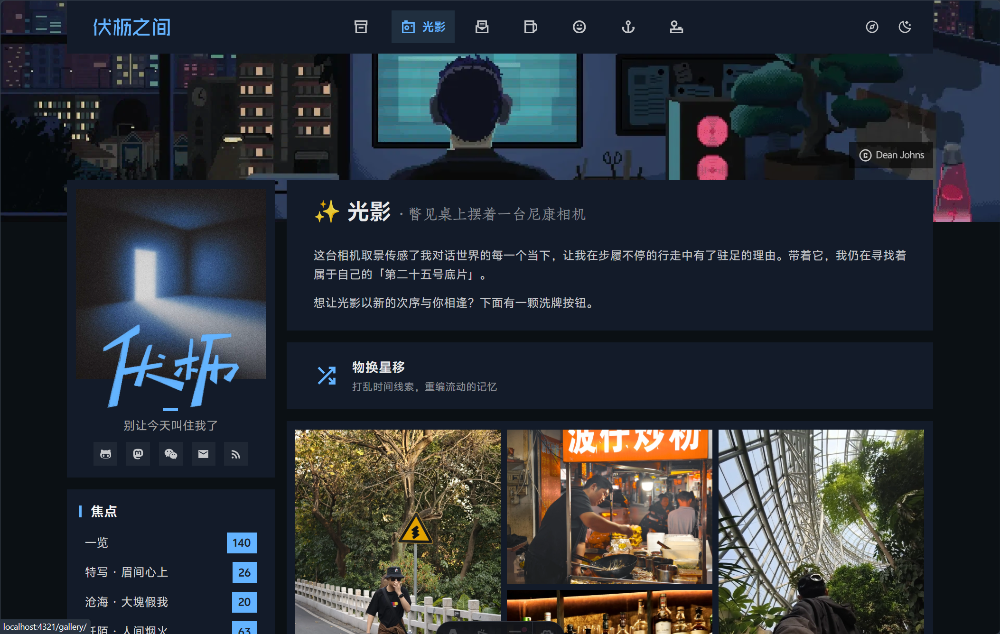
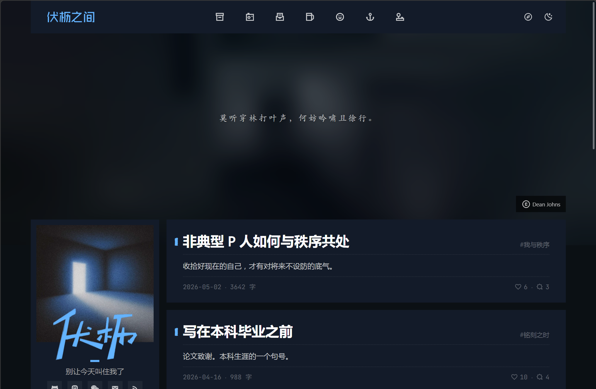
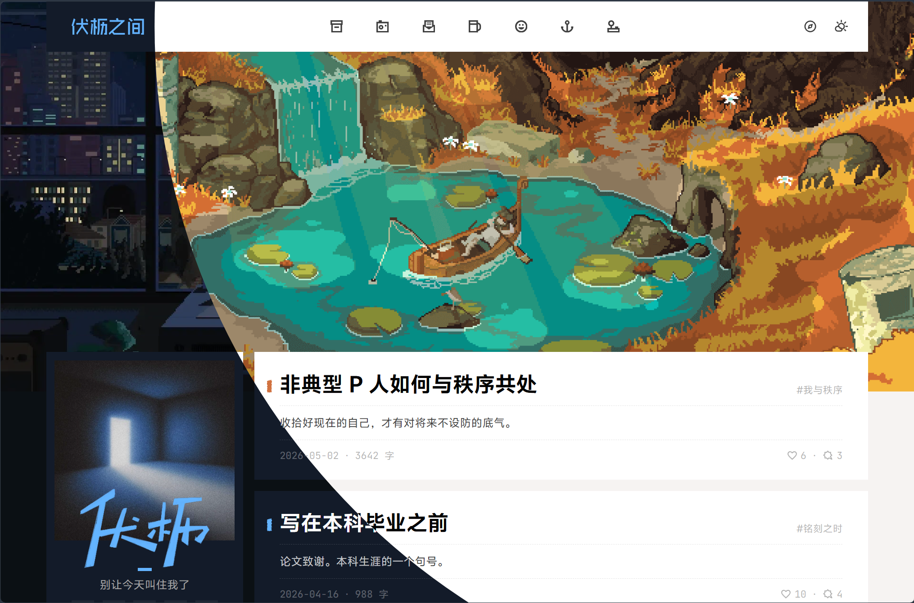
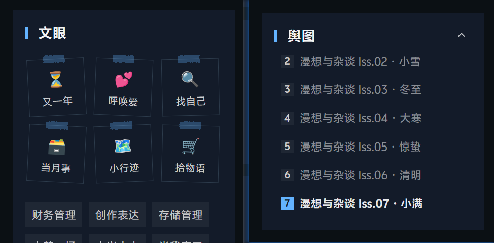
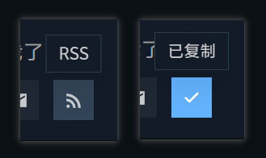
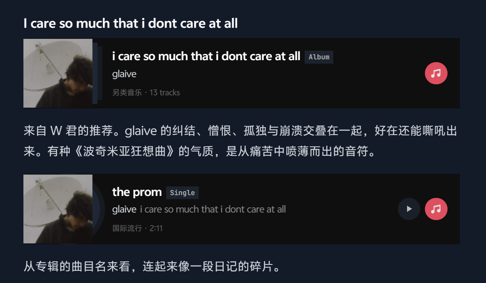
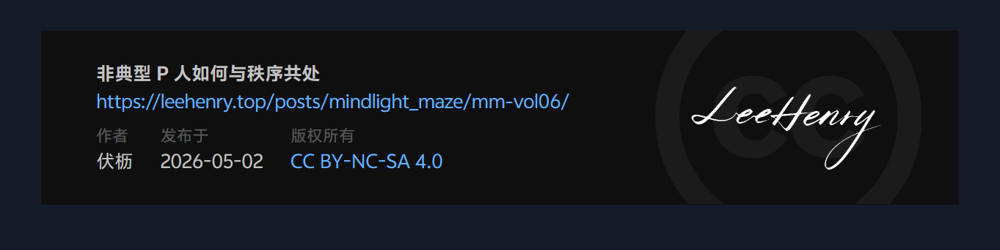

这段时间在「伏枥之间」实践了很多「鬼点子」和「小巧思」，用日新月异来形容完全不夸张。到现在终于收敛到了相对满意的状态，可以~~暂时~~告一段落。

下面的内容本来是~~月刊~~节气刊「漫想与杂谈」的固定板块「网站建设小报」（~~是的虽然拖了很久但真的已经在写了！对不起🙇‍♂️~~），结果写着写着洋洋洒洒来到两千字。很多引以为豪的设计实在不愿因篇幅删减，故另起一篇介绍之。

如果能给各位读者朋友带来耳目一新的体验，或是为博主朋友在网站交互上有所抛砖引玉，也不妨是美事一桩。

## 微板块[^1]

[^1]: 这里的「板块」指 slash pages

- 新增「[客邸](/guests/)」板块。为我一些朋友的内容腾出寄存的地方，正在缓慢迁移中。我爱他们，也爱他们文字的质地。我想在中心化公司外为之多留一份副本。

- 修改「[一隅](/about/)」板块。重写了很多内容，特别是 [🪶 Words](https://leehenry.top/about/#-words) 章节。我在这里介绍了「伏枥之间」的书写缘由、书写主题以及对 LLM 参与写作的态度。

  对了，即日起，本站承诺：**若无特殊声明，文字完全由人类书写；如有 AI 参与，将在标题处用「AI 使用披露标签」明确 AI 的参与比例与方式**。

- 修改「[友邻](/friends/)」板块。现在这个页面的「侧耳」板块（友邻的最新文章）被我放在更高优先级的位置，便利自己也便利访客通过彼此的文字触达彼此。比起单纯链接的交换，我会更在乎朋友们的文字和观点本身，**基于这些思想载体的交流，我想更接近*友链*这种形式作为「个体与个体」链接的初衷**。

- 修改「[光影](/gallery/)」板块。采纳了金色河流的 [建议](https://leehenry.top/posts/words_in_wildness/ww-vol08/#b1c53aff64d34d7f91237dcd21afe9a5)，增加了随机展示的按钮。

---

- 除「旧简」外，其余板块都把标题与引导语聚合到了一起，独立成卡片。

  

## 微体验

- 当第一次打开网站，我发现 banner 动图的加载会占据可观的时长。现在借鉴了电影启幕前的画外音字幕，在加载未完成时，使用 LQIP[^2]与 slogan 进行排版，以期用完成度更高的设计来减少加载过程带来的「等待感」。

  

[^2]: 全称是 Low Quality Image Placeholder，即低质量图像占位符

- 正文图片资源也支持加载过程中使用 LQIP 图片占位，提升了大图片的加载体验；此外图片资源额外增加了 1 px 大小的边框，这样当图片与背景同色时也不会与内容混淆了。

---

- 更换了亮色主题「昼景」的配色方案，主体色取自现在的 Banner —— 与暗色模式一样，同样是艺术家 [Dean Johns](https://www.behance.net/deanjohns1) 像素艺术作品。瀑布潺潺、阳光斜照，亮色的温暖与暗色主题「夜阑」的冷酷形成更鲜明的对比，也同样可以看作我两种不同人格的彰显。白天户外小憩，晚上静享安宁，这是我梦想的一天。

- 增加昼夜主题切换的动画，灵感来自于站点 [記緒漂流](https://ttio.cc/)。当按钮激活时，新的主题将以按钮为圆心，扩散到整个页面，日夜流转，焕然一新（~~这个 feature 我自己可以玩很久！~~）。

  

- 「文眼」标签体系分为两级，对于长期稳定更新的主题，现在使用了便利贴的设计令其更醒目；而在浏览这些系列文章时，侧边栏除了「经纬」的目录栏外，增加「舆图」栏作为系列间的导航。现在可以沿主题的轴线，查看我在不同的时间切片上的思考与成长。

  

- 「经纬」目录栏默认收起三级标题，当进入视口才展示，离开视口自动隐藏。对于长目录保持信息密度的同时显示更加整洁。

---

- 现在点击 RSS 按钮并不会跳转，只会将链接复制到剪贴板中。这是因为我意识到 RSS 订阅的原始页面并不重要，用户确有需求，只需要拷贝链接，再粘贴到自己的阅读器中。

  

- 现在文章支持在 frontmatter 标记 `unlisted` 字段，当存在标记，文章将仅出现在「旧简」的归档页面中，不进入首页和 RSS 信息流。一些功能性过强或过于不正式（但是又有存档价值的）的文章我会带上这个标记。

> 🤝 与我不谋而合的博客设计：[Jant](https://www.owenyoung.com/jant) 的 *Hidden from Latest* 功能

- 优化脚注的展示形式。文中的脚注可以通过在角标上悬停来预览内容，这样就不会因为上下跳转而切断阅读节奏了。
- 把中文的斜体渲染为*着重号*样式。「斜体」是语义上的强调，西文使用 *Italic* 字形，更原生自然，但中文字体一般不会针对斜体的字形分化做专门的设计，视觉上不好看，强调作用也很有限。因此我针对中文样式使用 Rehype 插件做了特判。

:::fold{summary="着重号的 CSS 实现细节"}

实现上，`padding-bottom` 在 inline 元素上不增加 line-box 高度，所以加 ` padding`  撑出绘制空间不会撑高行距，不会影响我预先设置好的行距与段距。利用 `radial-gradient` 配合  `background-size: 1em` 实现一个字宽对应一个圆点的平铺效果。

```stylus title="src/styles/markdown-extend.styl:707"
.emphasis-cjk
  font-style: normal                       // 取消 <em> 给的斜体
  padding-bottom: 0.3em                    // 撑出绘制空间
  background-image: radial-gradient(circle, var(--primary) 1.8px, transparent 1.8px)
  background-size: 1em 0.3em               // 每 1em 一个点
  background-repeat: repeat-x
  background-position: left bottom
```

:::

- 增加正文的「折叠框」支持。使用「叠了一角的纸张」的样式来在语义上提示这是「折叠」的内容。悬停标题行时，纸张高亮、角落铺平；单击，折叠内容被完整显示。

  收起内容有 2 种方式：一种是再次点击折叠框的标题行，一种是点击尾部高亮的小三角，即可让内容收起并回滚到原始位置[^3]。试试看？

[^3]: 单纯因为自己的神秘强迫症：看完一定要折叠回去，不然怎么看都不对劲。

:::fold{summary="【歌词节选】向日葵朝着夜 单依纯"}

<p style="text-align: center; font-family: serif;">
明年的向日葵请你晚开⼀点<br>
这样我才有时间朝着夜追<br>
也许是晚出生的我<br>
这么不会交际 不会热情 聊天不会<br>
随着命运挑战挑战我<br>
然后花就开到⼀样多<br>
满了我的眼睛<br>
再谈喜欢平淡 谈人生无常
</p>


::music{query="向日葵朝着夜 单依纯"}

:::

> 🎨 本站的完整样式陈列请移步：[No.47 草莓蛋糕失踪事件调查报告](https://leehenry.top/posts/words_in_wildness/markdown/)

## 微视觉

- 修改音乐卡片的样式细节。如果是专辑，封面下会出现体现厚度的方形叠层；如果是单曲，则会伸出一片圆形的唱片。

  

- 在文章尾部的版权卡片中增加 *LeeHenry* 的手写签名。

  

- 将站点的衬线字体替换为开源字体 [Zhuque Fangsong](https://github.com/TrionesType/zhuque)；并微调了超链接的样式：弱化下划线的存在感，使用衬线字体来与正文做出区分。

  现在衬线字体在全站的使用有了语义的一致性：一种是用在短文和诗句的全文，是「古朴和文学性」的象征；另一种是用在超链接与部分引用块，提示这是「外部内容」。

- 统一站点的所有图标，除了导航栏的图标与品牌图标外，均统一为 [Material Symbols](https://fonts.google.com/icons) 图标库的 `sharp` / `outline-sharp` 风格样式。现在「伏枥之间」目力所及的一切，都是「圆滑当道的锐利异类」[^4]。

[^4]: 是一句很喜欢的广告词，来自一个早已成为明日黄花的科技品牌。

<mbr>
