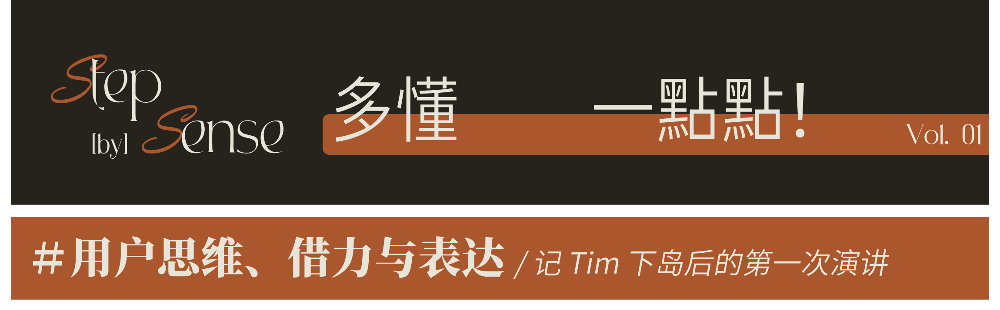
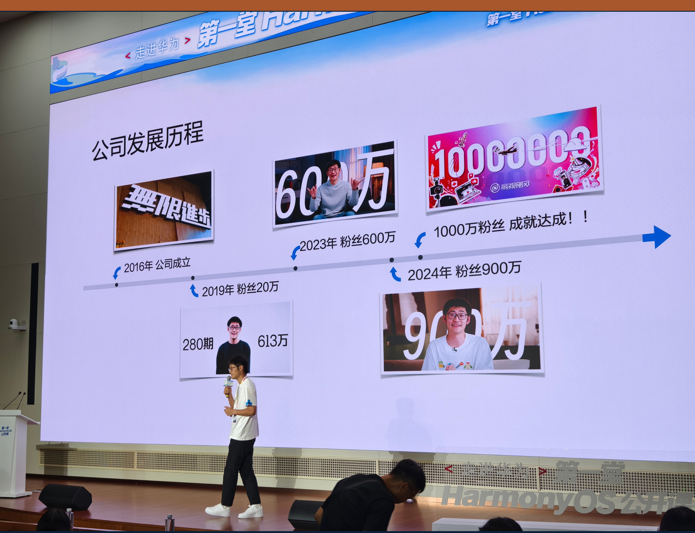
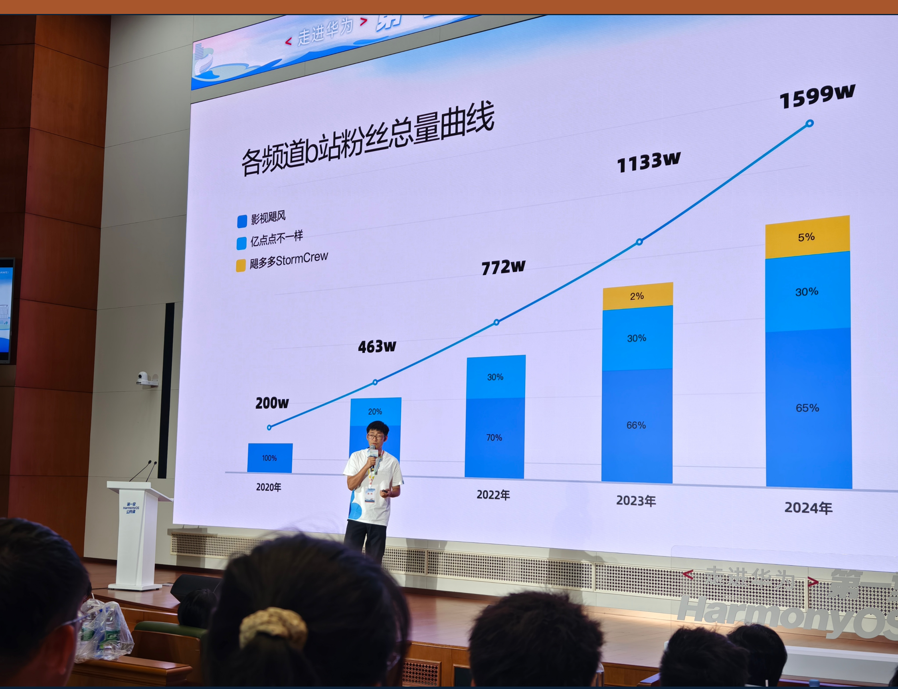
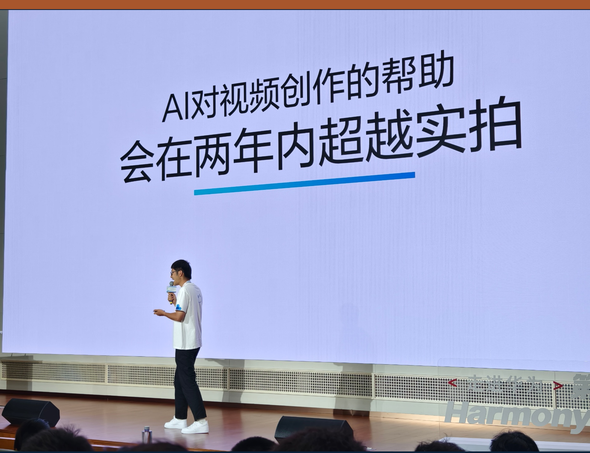
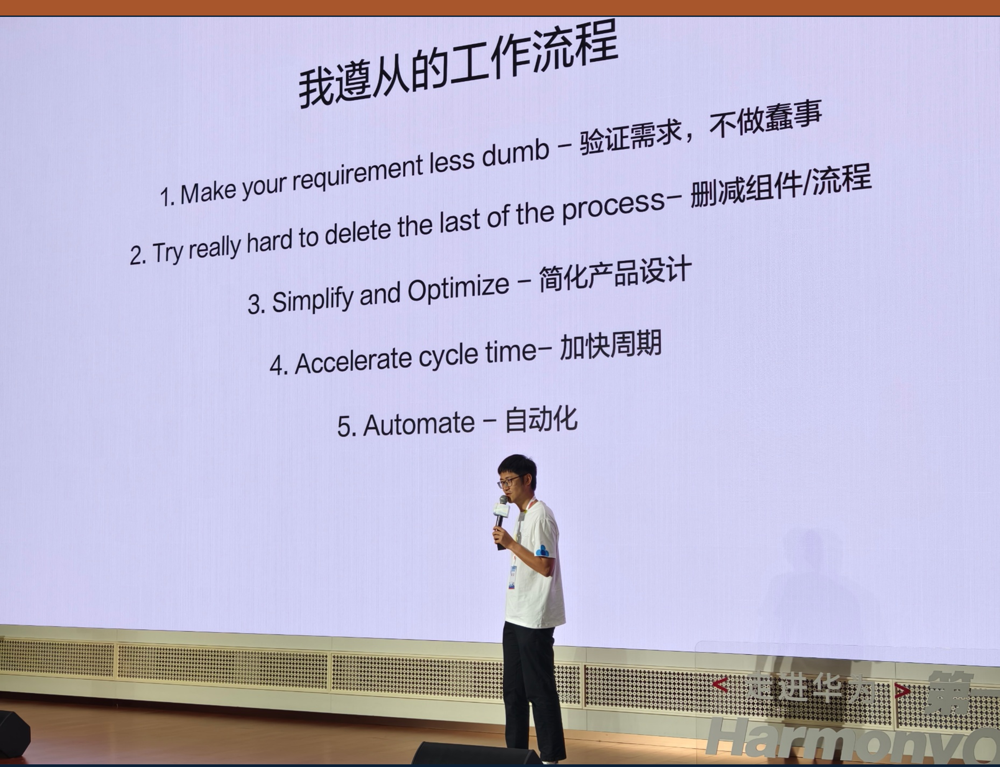
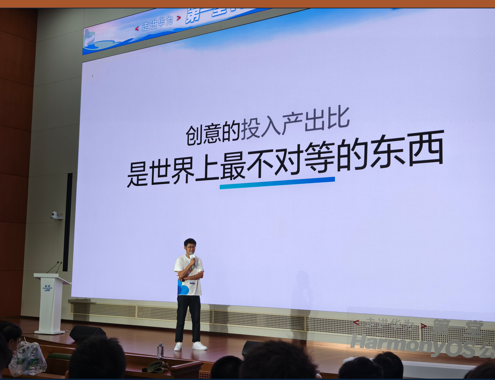
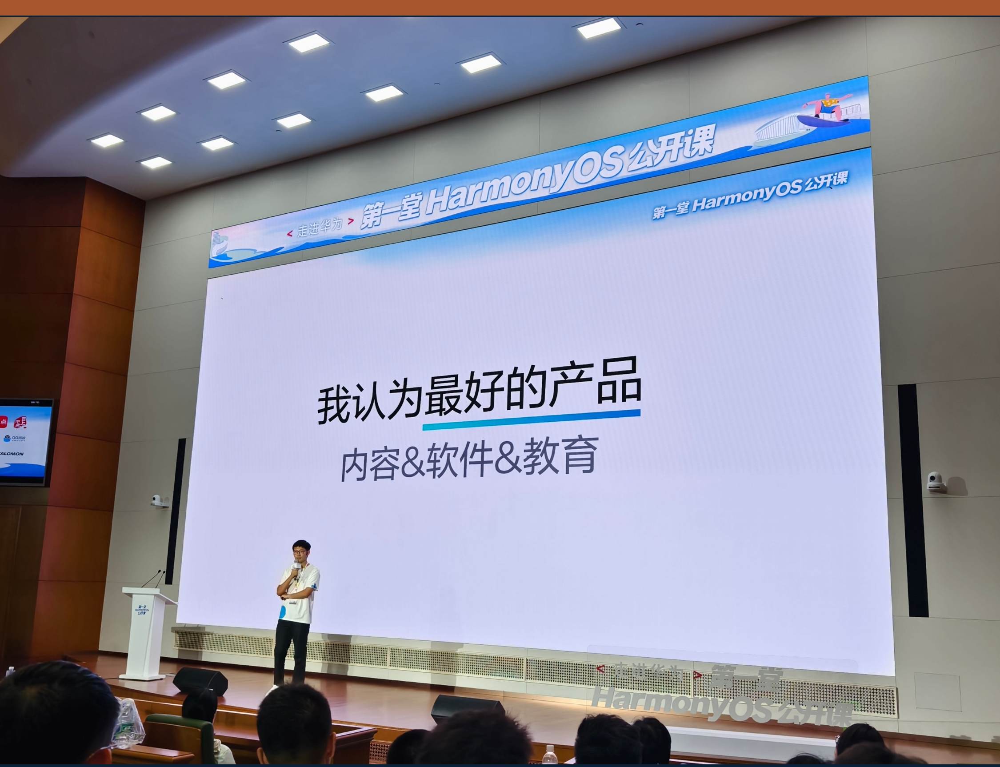
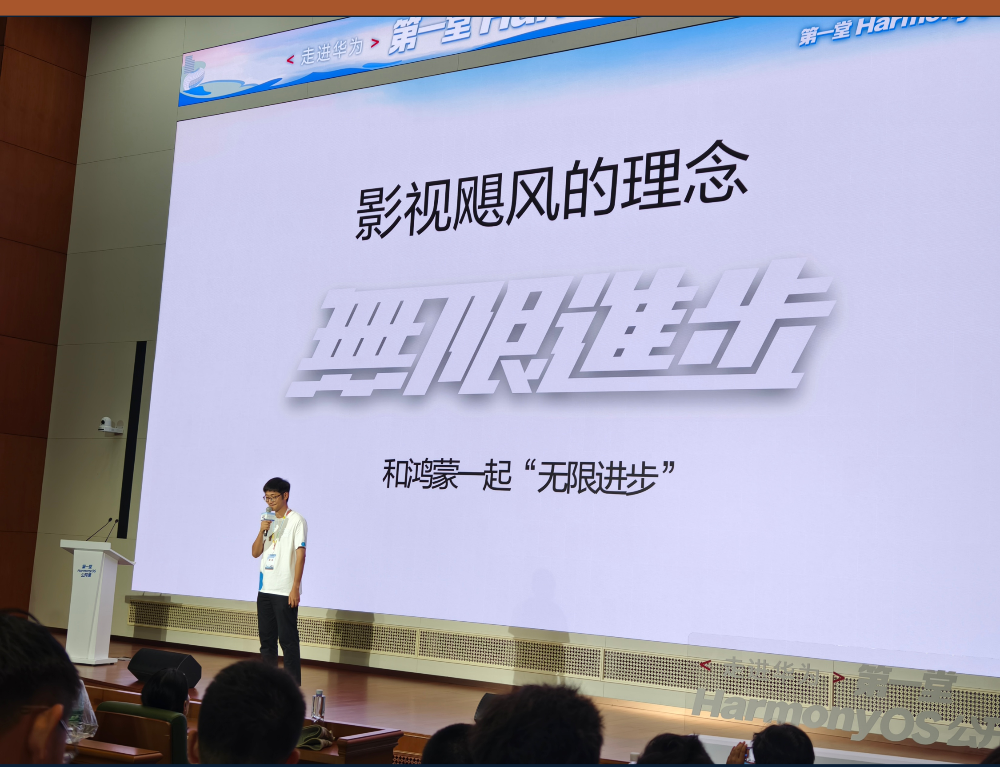

Tim 刚在荒岛上完成 100 小时的直播，第二天清晨六点便从杭州出发，赶到上海青浦的练秋湖园区。在华为 HarmonyOS 的邀请下，他带来了一场围绕用户思维、借力与表达的分享。从内容创作切入，延展出许多对各行各业都适用的新鲜视角。

而我恰好在华子实习，租的房子就在园区旁边。周末早上起床刷到这个消息，整个人从床上弹起，一脚油门冲去现场。悄悄跟着学生大部队混进会场，幸运地收获这次与 Tim 面对面的机会。

演讲内容让我收获良多。上一条小红书笔记已经引来不少关注，也有朋友好奇具体讲了什么。于是花点时间把要点整理出来，希望能对你有所启发。

---

开篇， Tim 回顾了自己做影视飓风的账号的历程。高二起以个人名义注册公司到现在，已十年有余。

他说，做自媒体，最重要的是什么？**时机。**

学生时代是一个天然的好时机——你不用被生计牵绊，可以全心全意奔赴自己真正热爱的事情。

## #1. 爆款对内容频道的价值

一个爆款视频对频道的增量有着巨大的推动作用。

> 比如“荒岛直播”——100小时的直播，让飓多多 StromCrew 账号涨粉100万，相当于平均每小时增长1万粉，用短短五天时间完成了过去两年的沉淀。

这就是爆款的杠杆效应：一次成功，能抵得上数年的积累。

## #2. 开口和受众决定内容上限

核心在于选择正确的方向，也就是用户思维。

影视行业的受众只有400万人，那么“影视飓风”如何覆盖千万级受众？方法是让影视的特性去覆盖更多的品类：

**跨领域延展**：如“亿点点不一样”，用特别的影视设备，让你从不一样的视角去“看到”课本或生活中熟悉的内容。

**切入大板块**：如旅游题材（《样片日记》《去了一趟》），让影视能力覆盖旅行这个比影视大几十倍的一级板块。

> 进一步延伸到**软件类产品**的开发：同样也需要考虑普通用户需求，思考投入能影响多少人。

## #3. 影视飓风的创作理念

### 精力偷取：借力的秘诀

创作不必事事从零开始，而是学会**站在巨人的肩膀上**。

站在巨人的肩膀上，是创作者的高效路径。数码类博主能经久不衰，因为他们在品鉴、体验数码设备的时候，本质是在“偷取”了数万人在软硬件研发上的心血，通过视频和文字再度转化为内容。

引申开来，很多创作都能找到“借力”的方式：

- **数码博主**：他们通过体验设备，本质上是“偷取”背后几万人研发的成果。
- **内容创作**：带影视飓风的标签，会借助其影响力获得更多流量。
    - “蹭热度”追热点“本质上也是借力增加曝光度的有效方式
- **剧本创作**：相比从零搭建一个完整世界，改编已有设定更容易。
- **人文纪录片**：借助专家知识、自然造物，效率更高。

> 延伸到**软件行业**，开发者基于已有操作系统和框架进行软件的开发，同样也是借力完成自己内容的过程。

### 行业高速增长的本质

**连续 → 多期 → 超级爆款**

保持高效的节奏，持续的产出，才能迎来真正的爆发。

初期量化目标：上热门；进阶目标：全站排行榜。

### AI 正在改变视频创作

Tim 预言：**两年内 AI 将超越实拍**。

> 比如“亿点点不一样”视频中空间站飞过的动态可视化，就是用 AI 特效生成的，但几乎没人能看出来。除此之外，行业内 AI 换口型的应用也已成熟并真实到足够不可感。

### 五步工作法：让任务分子化

Tim 将工作拆解为按顺序完成的五步：

1. Make your requirement less dumb **验证需求，不做蠢事**
2. Try really hard to delete the last of the process **删减组件/流程**
3. Simplify and Optimize **简化产品设计**
4. Accelerate cycle time **加快周期**
5. Automate **自动化**

> 以“岛屿生存”项目为例：
>
> - 海岛 → 小岛：租下海岛需上千万，几乎不可行。通过验证需求，“海岛→小岛”的微调，就让项目落地。小岛生存既满足了观众对隔绝生存的需求，也能控制成本。
> - 项目的核心是“真实”，以及开放讨论的环境。由此海岛摄影任务的核心也不是画质，而是真实记录。

### 创意的投入产出比是世界上最不对等的东西

好的创意价值远超执行本身。它往往是决定成败的最大因素。

这与前文所说的“选择正确开口和受众”可以呼应。

### 什么是天底下最好的产品？

具备五大属性：

- **无限库存 + 无限产能 + 受众广泛 + 自由定价 + 超高需求**

所以 Tim 给出的答案是：**内容、软件、教育。**

## #4. Q&A 环节的几点启示

- **用户思维永远重要**：解决了真实需求，即使是简单的功能，也可能有百万级用户。比如“记录喝水”的软件。
- **不要过度纠结技能学习**：视频制作的视觉技能壁垒正在被 AI 迅速消解。真正要思考的，是“真人会觉得有意思的事”。当专业壁垒消失，视频的核心回到表达与内容。

## #5. One More Thing：StormDay2025

Tim 在今年 StormDay2025 的公开演讲中也谈到并延伸了部分类似的观点，下面是当时做出的总结，可以作为延伸的参考阅读：

> 录播链接：bilibili.com/video/BV15Z3izzEQp

- **现场节目受欢迎的原因**：观众不再愿意听“说教”，而更希望你在某个情境下，作为一个“人”来表达。
- **内容突围的核心：幽默感。**我的理解是——把自己变得有趣，内容自然就有趣。
- **AI进步，剪辑能力的门槛在降低**，比起花时间去学炫酷的转场，更重要的是学会“连贯自然的情绪表达”和“讲好一个故事”。

### 创作技巧提示

**现场节目（vlog类）**

- vlog 录制用广角（Pocket 3 防抖后20mm的焦段）让观众有自然交流的感受。
- 情绪表达和美景记录分离：70%情绪 + 30%美景（甚至可以单独花一天只记录情绪）
- 减少机位，控制在1-2个，降低创作复杂度

**叙述节目（写作/表达类）**

- **观点收集**：先用思维导图记录一切闪念，再合并同类项，避免遗漏和重复
    - 这部分也适用于写作与灵感整理
- **手段与观点**：手段是表达观点的工具，始终要为观点服务
- **表达方式**：学会自然使用提词器——冗余动作、情绪感、眼神离开再回来，能让表达更真实
- **声音的重要性**：声音某种程度上比画面还重要。一定要二次确认录制声音的情况

## #6. 我的Takeaway Message

这堂课给我最大的启发是：
 **创作的价值在于方向与创意，而非技能堆砌。**

在 AI 不断吞噬专业壁垒的当下，真正值得投入的，是思考、表达，以及“作为人”的独特视角。

无论是视频、写作还是软件开发，成功作品的逻辑与本质其实相通：找到真正的需求，用巧妙的方式借力，再用自然、有趣的表达打动人。

