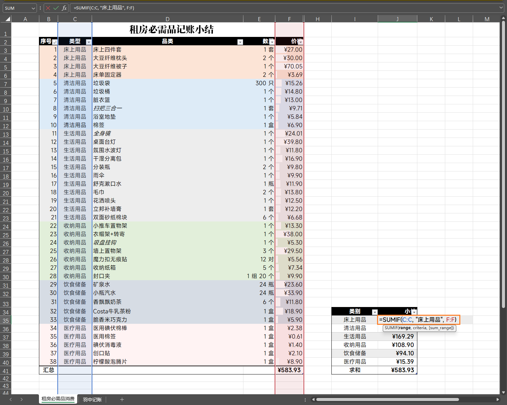
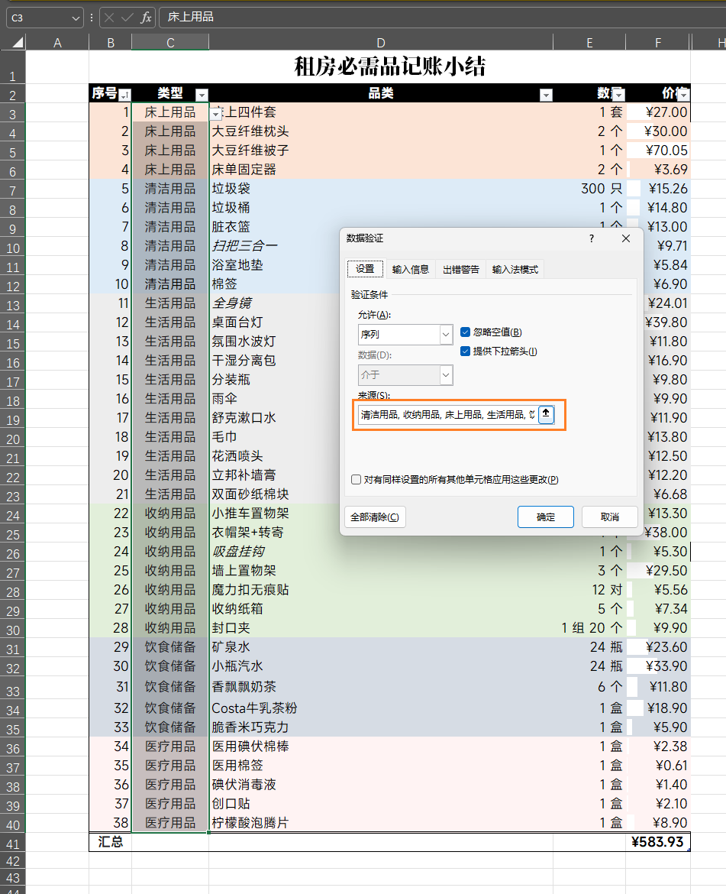

搬出来住以后，我发现**维护一份能“自己动起来”的费用表**特别有用——不仅能随时掌握在各个模块花了多少钱，帮助未来的消费决策，而且能快速复用到其他的记录场景，快速实现高需求自定义的智慧账本。以下是我边学边做学会的 4 个自动化小技巧。


### **前置学习：公式里的 `$` 有什么用？**

**学公式之前，先搞懂 `$` 的用法**👇

在 Excel 里，公式是会跟着单元格位置自动调整的，比如：

```
= A1 + B1
```

如果你把它向下复制一行，就会变成：

```
= A2 + B2
```

**`$`** 用来“锁住”行号或列号，让它在复制时不变：

- `$A$1`：列和行都锁住，不管怎么复制，永远指向 A1
- `A$1`：只锁住行号 1，列会随复制方向变化
- `$A1`：只锁住列 A，行会随复制方向变化

这对写条件格式、跨区域引用数据特别重要，后面几个公式就会用到它。

### **技巧一：序号自动编号**

根据当前行号来判断当前的序号，在任意地方插入新行都不会破坏顺序。


**公式**：`=ROW()-2`

**解释**：

1. `ROW()` 返回当前单元格的行号，例如第 3 行就是 3。
2. 因为前两行是表头，所以要减 2，让序号从 1 开始。
3. 插入或删除行时，行号会自动更新。

### **技巧二：按类别自动求和**

根据[类型]这一列的字段来计算对应[价格]的总数，不要求同类数据相邻，Excel 会遍历整列匹配后再求和。



**公式**：`=SUMIF(C:C, "清洁用品", F:F)`

**解释**：

1. `C:C` 是条件列（类型）
2. `"清洁用品"` 是匹配条件
3. `F:F` 是要求和的列（价格）

### **技巧三：下拉菜单限定类别**

指定[类型]这一列的字段只能从[床上用品]到[医疗用品]中的六大类别来选择。



**操作**：

1. 选中类型列 → 数据 → 数据验证
2. 验证条件：选择`序列`，勾选`忽略空值`、`提供下拉箭头`
3. 来源：`清洁用品,收纳用品,床上用品,生活用品,饮食储备,医疗用品`

- **解释**：把可选内容限定在固定范围，避免手动输入出错。

### **技巧四：条件格式一键着色**


**操作**：

1. 选中全表内容 → 开始 → 条件格式 → 新建规则 
2. 规则类型：选择`使用公式确定单元格`
3. 规则说明：填写根据的那一列内容开始的那一行，如`=$D3="医疗用品"`
4. 设置指定填充颜色
5. 应用于：填写整个数据区域，如 `=$C$3:$H$40`

**原理**：

1. `$D` 锁住列 D，保证公式始终参考“类型”列
2. 行号不加 `$`，让格式随行变化，逐行判断
3. 当当前行的 D 列等于“医疗用品”时，应用你设定的填充色。

### 小结

 学会 `$` 的用法，Excel 自动化的灵魂就打开了一半。剩下的一半，就是多用多试，让公式变成你的生活小工具。这些功能学会以后，表格不再只是个静态账本，而是会自己计算、自己分类、自己高亮的小帮手。

