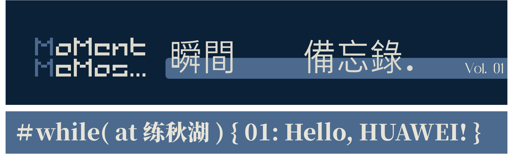
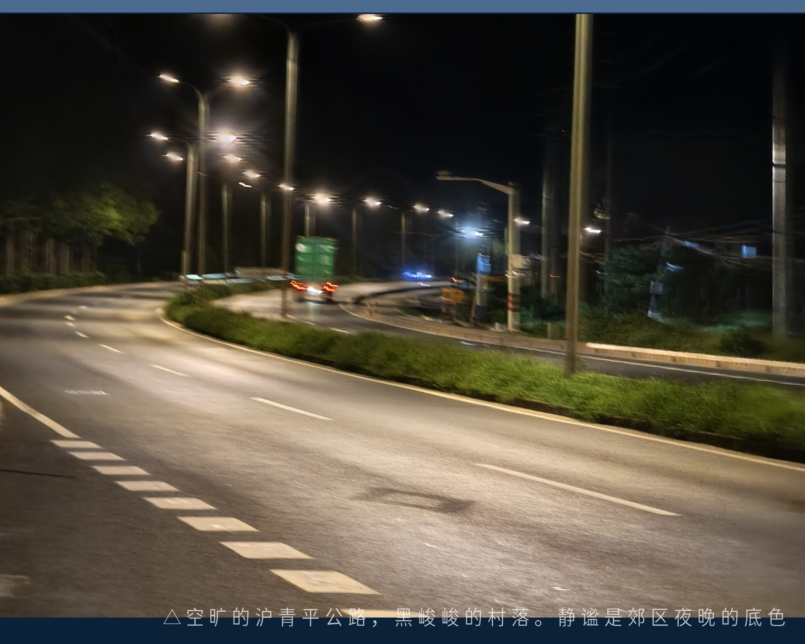
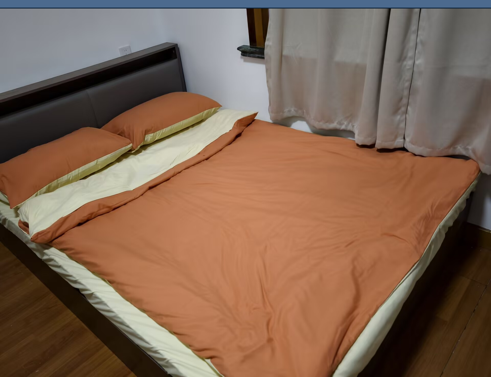
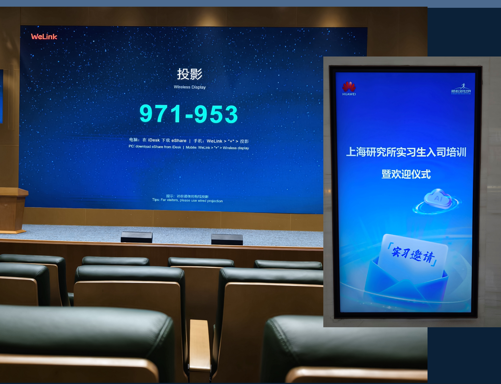
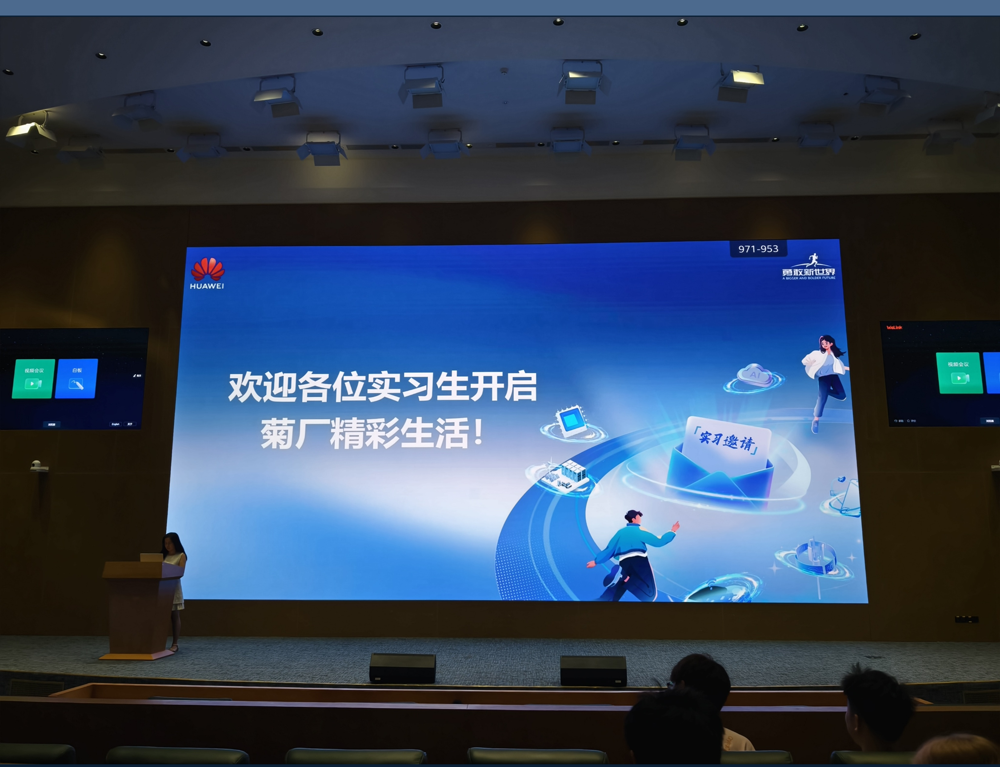
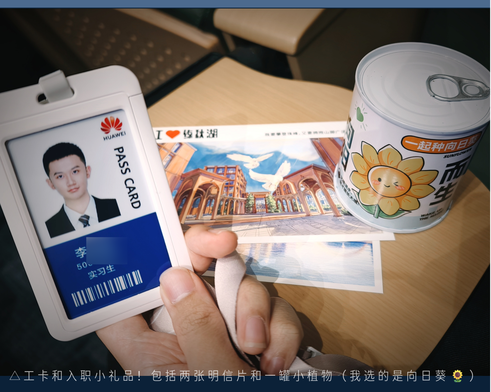
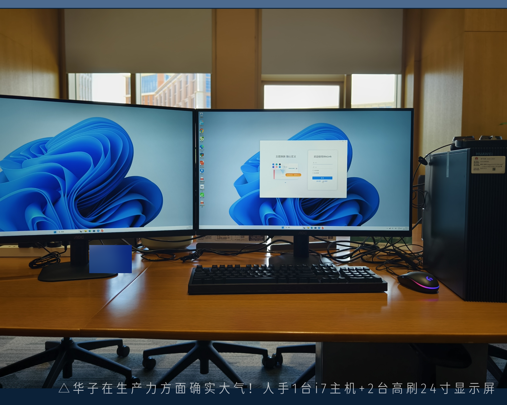

其实从入职前一晚就已经启程。

---

昨天，是刚参与完华师一场“重在参与”的夏令营——讲座坐牢一天，机考意义不明，结束时天色已晚。回到宿舍，盯着前一天就下单的 512G 存储卡，原本计划到达的时间本来应该就是今天，结果物流一直卡在了上海市区的某个神秘节点。眼见七点半了，反复打开京东物流，页面仍未更新。（注：现在又过去了三天！物流还是卡在这里！狗东 Tell me why? Baby, why?!）

By the way，我现在有了钥匙——车钥匙和房门钥匙！一墙的钥匙扣终于有了用武之地！发现绝大部分都有点大的夸张（丢倒是不会丢了……）最后选了面面，嘻嘻，可爱小男孩一只。

依依不舍（其实更多是懒）打点好之前准备好的衣架和手电筒（村里的晚上确实是黑的有些可怖），再把押一付一的三千块房租打给房东，导航启动，动身出发。

这是真正意义上披星戴月的一程，已经是我在这条线路上的第三趟。想起当时第一次去看房在路上花的三小时，不想太耽误时间，顺路买了麦麦就上了地铁。

早前寄错成老家地址的被子因转寄姗姗来迟。临睡前最后一件事，是把柔软的新被子铺好。

这次的床不用再爬梯，也没有舍友临睡前的轻声说话。郊区的夜空没有光污染，月色清澈，静静陪我度过这个出租屋的第一个夜晚。

晚安啦。

---

第二天，被蝉鸣叫醒，正式开启实习的第一天。

拉开窗帘，一整面清透的阳光扑面而来，久违的直接、热情。果然，选朝南的房间是对的！

循着之前踩好的路线，抵达园区，再依照入职导航的引导，前往迎接新一批实习生的报告厅。

园区面积高达两千多亩，去年才落成，相当崭新。建筑间风格迥异，却意外地和谐，高低起伏错落有致，像大型管弦乐队中不同乐器共同演奏的和弦。流线勾勒出建筑的几何外形，配上外立面有温度的色彩点缀，现代但不显得冰冷。视觉重心被宽广延伸的道路和气势恢宏的雕塑稳固。我突然想起那句老话：“建筑，是凝固的音乐”。而在这座建筑群中穿梭的每一位从业者，才是园区得以运转的真正的主旋律。

河网与湖面纵横交错，将园区划分成多个板块，涂装成西欧风格的小火车沿着河边来回接驳，无疑，这里已经形成了一套高度自洽的生态系统。

也许是因为担心迟到，又或许是过度激动，早到足足五十分钟，竟成为报告厅的第一人。四散的灯光照亮巨大投影和空旷舞台，我选了一个正中位置，静静等待。

随后前往部门。到楼下正巧迎面撞上 Mentor 和与我另外一个实习的小伙伴。于是跟着一起去领取工作用的设备~

虽然没有正式工位，暂时驻扎在部门旁边的空会议室，但在这工作的感受意外很不错！

面前和侧边是整片湖面和蓝天，让我得以具体感知太阳东升西沉与四时变化，比起逼仄的格子间，这里反而更具自由感和喘息的留白。键盘也不必过度压抑以至影响到周遭同事，更重要的是可以在这里享受专注和独处。嗯，我喜欢。

第一天因为很多网络权限还没来得及开通，Mentor 发的参考文档涉及的软件配置举步维艰。相比课堂内图形学浅尝辄止学到的 OpenGL 知识，这里需要朝夕相处的 Vulcan 编程学习曲线陡峭的夸张——调用接口与架构层层嵌套，仿佛你在用你自己的大脑指导身体的每一个器官如何同时运转。可怕，但也好奇。

不过没关系，这个夏日正处热烈。
 “每一个伟大背后，都有一个微不足道的开始。”
 Hello, Huawei. 我们开始了。

