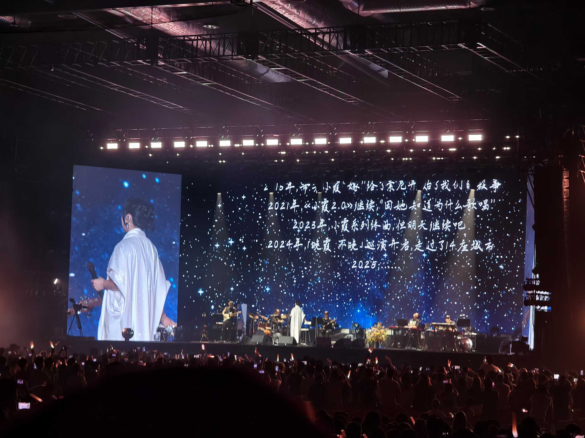
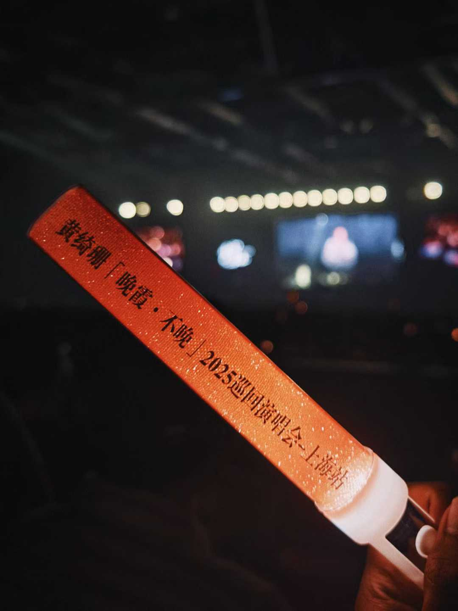
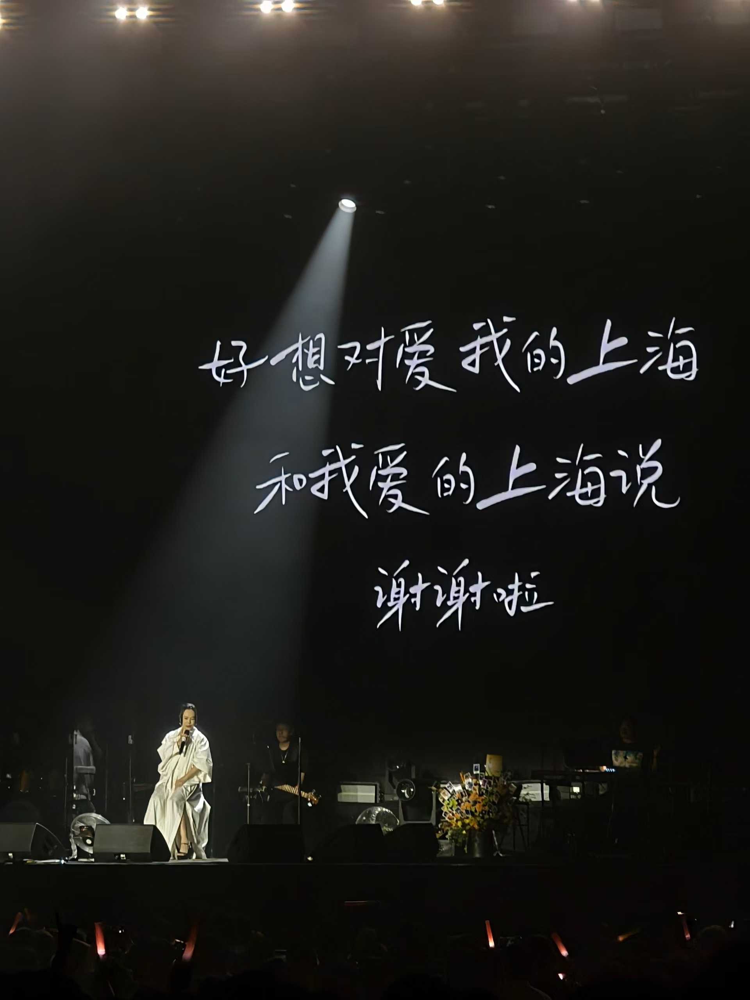

黄妈人生的倒数第二场演唱会，我人生的第一场。

前半场递麦的段落太多。我能理解五十八岁的她的力不从心，但难免有些失落....直到中场后，她意外的开始毫不保留，扎实的高音如潮水般——《离不开你》《灯塔》《回来》连唱，透过“小霞”，恍惚间我看到了《我是歌手》第一季，那个全盛时期的黄绮珊。

颅内高潮真实袭来，这才感触到现场的魅力：发生在此刻，仅属于这里。散场后，地铁的轰鸣和余音交错，像一场无法回放的梦。

